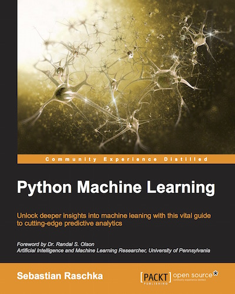
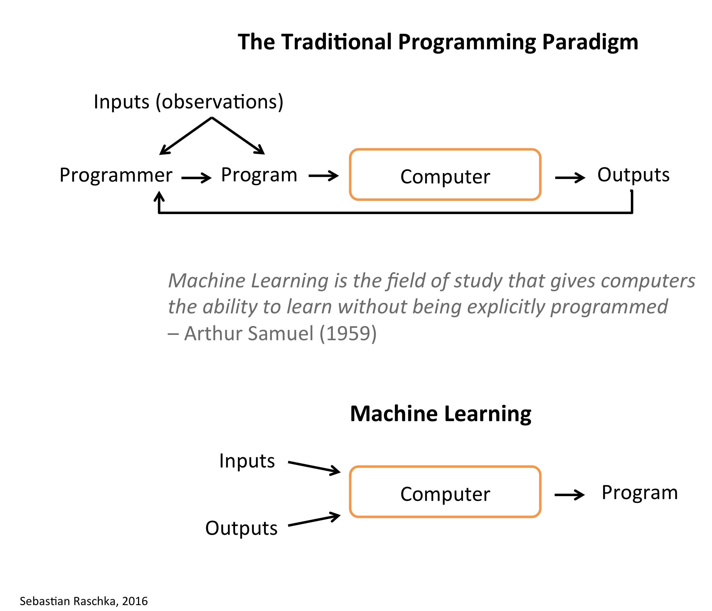

# python-machine-learning-book

*Python Machine Learning* code repository.

What you can expect are 400 pages rich in useful material just about everything you need to know to get started with machine learning ... from theory to the actual code that you can directly put into action! This is not yet just another "this is how scikit-learn works" book. I aim to explain all the underlying concepts, tell you everything you need to know in terms of best practices and caveats, and
we will put those concepts into action mainly using NumPy, scikit-learn, and Theano.

You are not sure if this book is for you? Please checkout the excerpts from the [Foreword](./docs/foreword_ro.pdf) and [Preface](./docs/preface_sr.pdf), or take a look at the [FAQ](#faq) section for further information.

---

1st edition, published September 23rd 2015 
Paperback: 454 pages 
Publisher: Packt Publishing   
Language: English 
ISBN-10: 1783555130   
ISBN-13: 978-1783555130 
Kindle ASIN: B00YSILNL0 

### [Feedback & Reviews](./docs/feedback.md)

---
> *Sebastian Raschka’s new book, Python Machine Learning, has just been released. I got a chance to read a review copy and it’s just as I expected - really great! It’s well organized, super easy to follow, and it not only offers a good foundation for smart, non-experts, practitioners will get some ideas and learn new tricks here as well.*  
– Lon Riesberg at [Data Elixir](http://dataelixir.com/issues/55#start)

> *Superb job! Thus far, for me it seems to have hit the right balance of theory and practice…math and code!*   
– [Brian Thomas](http://sebastianraschka.com/blog/2015/writing-pymle.html#comment-2295668894)

> *I've read (virtually) every Machine Learning title based around Scikit-learn and this is hands-down the best one out there.*    
– [Jason Wolosonovich](https://www.linkedin.com/pulse/python-machine-learning-sebastian-raschka-review-jason-wolosonovich?trk=prof-post)

## Links

- ebook and paperback at [Amazon.com](http://www.amazon.com/Python-Machine-Learning-Sebastian-Raschka/dp/1783555130/ref=sr_1_2?ie=UTF8&qid=1437754343&sr=8-2&keywords=python+machine+learning+essentials), [Amazon.co.uk](http://www.amazon.co.uk/Python-Machine-Learning-Sebastian-Raschka/dp/1783555130), [Amazon.de](http://www.amazon.de/s/ref=nb_sb_noss_2?__mk_de_DE=ÅMÅŽÕÑ&url=search-alias%3Daps&field-keywords=python+machine+learning)
- [ebook and paperback](https://www.packtpub.com/big-data-and-business-intelligence/python-machine-learning) from Packt (the publisher)
- at other book stores: [Google Books](https://books.google.com/books?id=GOVOCwAAQBAJ&source=gbs_slider_cls_metadata_7_mylibrary), [O'Reilly](http://shop.oreilly.com/product/9781783555130.do), [Safari](https://www.safaribooksonline.com/library/view/python-machine-learning/9781783555130/), [Barnes & Noble](http://www.barnesandnoble.com/w/python-machine-learning-essentials-sebastian-raschka/1121999969?ean=9781783555130), [Apple iBooks](https://itunes.apple.com/us/book/python-machine-learning/id1028207310?mt=11), ...
- social platforms: [Goodreads](https://www.goodreads.com/book/show/25545994-python-machine-learning)

### [Literature References & Further Reading Resources](./docs/references.md)

### [Image Gallery](./images/image_gallery/README.md)

### [Errata](./docs/errata.md)

## Table of Contents and Code Notebooks

Simply click on the `ipynb`/`nbviewer` links next to the chapter headlines to view the code examples (currently, the internal document links are only supported by the NbViewer version).
**Please note that these are just the code examples accompanying the book, which I uploaded for your convenience; be aware that these notebooks may not be useful without the formulae and descriptive text.**   

- Excerpts from the [Foreword](./docs/foreword_ro.pdf) and [Preface](./docs/preface_sr.pdf)
- [Instructions for setting up Python and the Jupiter Notebook](./code/ch01/README.md)  

 

1. Machine Learning - Giving Computers the Ability to Learn from Data [[dir](./code/ch01)] [[ipynb](./code/ch01/ch01.ipynb)] [[nbviewer](http://nbviewer.ipython.org/github/rasbt/python-machine-learning-book/blob/master/code/ch01/ch01.ipynb)]
2. Training Machine Learning Algorithms for Classification [[dir](./code/ch02)] [[ipynb](./code/ch02/ch02.ipynb)] [[nbviewer](http://nbviewer.ipython.org/github/rasbt/python-machine-learning-book/blob/master/code/ch02/ch02.ipynb)]
3. A Tour of Machine Learning Classifiers Using Scikit-Learn [[dir](./code/ch03)] [[ipynb](./code/ch03/ch03.ipynb)] [[nbviewer](http://nbviewer.ipython.org/github/rasbt/python-machine-learning-book/blob/master/code/ch03/ch03.ipynb)]
4. Building Good Training Sets – Data Pre-Processing [[dir](./code/ch04)] [[ipynb](./code/ch04/ch04.ipynb)] [[nbviewer](http://nbviewer.ipython.org/github/rasbt/python-machine-learning-book/blob/master/code/ch04/ch04.ipynb)]
5. Compressing Data via Dimensionality Reduction [[dir](./code/ch05)] [[ipynb](./code/ch05/ch05.ipynb)] [[nbviewer](http://nbviewer.ipython.org/github/rasbt/python-machine-learning-book/blob/master/code/ch05/ch05.ipynb)]
6. Learning Best Practices for Model Evaluation and Hyperparameter Optimization [[dir](./code/ch06)] [[ipynb](./code/ch06/ch06.ipynb)] [[nbviewer](http://nbviewer.ipython.org/github/rasbt/python-machine-learning-book/blob/master/code/ch06/ch06.ipynb)]
7. Combining Different Models for Ensemble Learning [[dir](./code/ch07)] [[ipynb](./code/ch07/ch07.ipynb)] [[nbviewer](http://nbviewer.ipython.org/github/rasbt/python-machine-learning-book/blob/master/code/ch07/ch07.ipynb)]
8. Applying Machine Learning to Sentiment Analysis [[dir](./code/ch08)] [[ipynb](./code/ch08/ch08.ipynb)] [[nbviewer](http://nbviewer.ipython.org/github/rasbt/python-machine-learning-book/blob/master/code/ch08/ch08.ipynb)]
9. Embedding a Machine Learning Model into a Web Application [[dir](./code/ch09)] [[ipynb](./code/ch09/ch09.ipynb)] [[nbviewer](http://nbviewer.ipython.org/github/rasbt/python-machine-learning-book/blob/master/code/ch09/ch09.ipynb)]
10. Predicting Continuous Target Variables with Regression Analysis [[dir](./code/ch10)] [[ipynb](./code/ch10/ch10.ipynb)] [[nbviewer](http://nbviewer.ipython.org/github/rasbt/python-machine-learning-book/blob/master/code/ch10/ch10.ipynb)]
11. Working with Unlabeled Data – Clustering Analysis [[dir](./code/ch11)] [[ipynb](./code/ch11/ch11.ipynb)] [[nbviewer](http://nbviewer.ipython.org/github/rasbt/python-machine-learning-book/blob/master/code/ch11/ch11.ipynb)]
12. Training Artificial Neural Networks for Image Recognition [[dir](./code/ch12)] [[ipynb](./code/ch12/ch12.ipynb)] [[nbviewer](http://nbviewer.ipython.org/github/rasbt/python-machine-learning-book/blob/master/code/ch12/ch12.ipynb)]
13. Parallelizing Neural Network Training via Theano [[dir](./code/ch13)] [[ipynb](./code/ch13/ch13.ipynb)] [[nbviewer](http://nbviewer.ipython.org/github/rasbt/python-machine-learning-book/blob/master/code/ch13/ch13.ipynb)]

 

**Bonus Notebooks (not in the book)**

- Logistic Regression Implementation [[dir](./code/bonus)] [[ipynb](./code/bonus/logistic_regression.ipynb)] [[nbviewer](http://nbviewer.ipython.org/github/rasbt/python-machine-learning-book/blob/master/code/bonus/logistic_regression.ipynb)]
- A Basic Pipeline and Grid Search Setup [[dir](./code/bonus)] [[ipynb](./code/bonus/svm_iris_pipeline_and_gridsearch.ipynb)] [[nbviewer](http://nbviewer.ipython.org/github/rasbt/python-machine-learning-book/blob/master/code/bonus/svm_iris_pipeline_and_gridsearch.ipynb)]
- An Extended Nested Cross-Validation Example [[dir](./code/bonus)] [[ipynb](./code/bonus/nested_cross_validation.ipynb)] [[nbviewer](http://nbviewer.ipython.org/github/rasbt/python-machine-learning-book/blob/master/code/bonus/nested_cross_validation.ipynb)]
- A Simple Barebones Flask Webapp Template [[view directory](./code/bonus/flask_webapp_ex01)][[download as zip-file](https://github.com/rasbt/python-machine-learning-book/raw/master/code/bonus/flask_webapp_ex01/flask_webapp_ex01.zip)]
- Reading handwritten digits from MNIST into NumPy arrays [[GitHub ipynb](./code/bonus/reading_mnist.ipynb)] [[nbviewer](http://nbviewer.ipython.org/github/rasbt/python-machine-learning-book/blob/master/code/bonus/reading_mnist.ipynb)]
- Scikit-learn Model Persistence using JSON [[GitHub ipynb](./code/bonus/scikit-model-to-json.ipynb)] [[nbviewer](http://nbviewer.ipython.org/github/rasbt/python-machine-learning-book/blob/master/code/bonus/scikit-model-to-json.ipynb)]
- Multinomial logistic regression / softmax regression [[GitHub ipynb](./code/bonus/softmax-regression.ipynb)] [[nbviewer](http://nbviewer.ipython.org/github/rasbt/python-machine-learning-book/blob/master/code/bonus/softmax-regression.ipynb)]

**Note**

I have set up a separate library, [`mlxtend`](http://rasbt.github.io/mlxtend/), containing additional implementations of machine learning (and general "data science") algorithms. I also added implementations from this book (for example, the decision region plot, the artificial neural network, and sequential feature selection algorithms) with additional functionality.

 

---

***Dear readers***,  
first of all, I want to thank all of you for the great support! I am really happy about all the great feedback you sent me so far, and I am glad that the book has been so useful to a broad audience.

Over the last couple of months, I received hundreds of emails, and I tried to answer as many as possible in the available time I have. To make them useful to other readers as well, I collected many of my answers in the FAQ section (below).

In addition, some of you asked me about a platform for readers to discuss the contents of the book. I hope that this would provide an opportunity for you to discuss and share your knowledge with other readers:

#### [Google Groups Discussion Board](https://groups.google.com/forum/#!forum/python-machine-learning-reader-discussion-board)

(And I will try my best to answer questions myself if time allows! :))

> The only thing to do with good advice is to pass it on. It is never of any use to oneself.  
— Oscar Wilde

---

## FAQ

### General Questions

- [What are machine learning and data science?](./faq/datascience-ml.md)
- [Why do you and other people sometimes implement machine learning algorithms from scratch?](./faq/implementing-from-scratch.md)
- [What learning path/discipline in data science I should focus on?](./faq/data-science-career.md)
- [At what point should one start contributing to open source?](./faq/open-source.md)
- [How important do you think having a mentor is to the learning process?](./faq/mentor.md)
- [Where are the best online communities centered around data science/machine learning or python?](./faq/ml-python-communities.md)
- [How would you explain machine learning to a software engineer?](./faq/ml-to-a-programmer.md)
- [How would your curriculum for a machine learning beginner look like?](./faq/ml-curriculum.md)
- [What is the Definition of Data Science?](./faq/definition_data-science.md)
- [How do Data Scientists perform model selection? Is it different from Kaggle?](./faq/model-selection-in-datascience.md)

### Questions about the Machine Learning Field

- [What are some real-world examples of applications of machine learning in the field?](./faq/ml-examples.md)
- [What are the different fields of study in data mining?](./faq/datamining-overview.md)
- [What are differences in research nature between the two fields: machine learning & data mining?](./faq/datamining-vs-ml.md)
- [How do I know if the problem is solvable through machine learning?](./faq/ml-solvable.md)
- [What are the origins of machine learning?](./faq/ml-origins.md)
- [How was classification, as a learning machine, developed?](./faq/classifier-history.md)
- [Which machine learning algorithms can be considered as among the best?](./faq/best-ml-algo.md)
- [What are the broad categories of classifiers?](./faq/classifier-categories.md)
- [What is the difference between a classifier and a model?](./faq/difference_classifier_model.md)
- [What is the difference between a parametric learning algorithm and a nonparametric learning algorithm?](./faq/parametric_vs_nonparametric.md)
- [What is the difference between a cost function and a loss function in machine learning?](./faq/cost-vs-loss.md)

### Questions about ML Concepts and Statistics

##### Cost Functions and Optimization

- [Fitting a model via closed-form equations vs. Gradient Descent vs Stochastic Gradient Descent vs Mini-Batch Learning -- what is the difference?](./faq/closed-form-vs-gd.md)
- [How do you derive the Gradient Descent rule for Linear Regression and Adaline?](./faq/linear-gradient-derivative.md)

##### Regression Analysis

- [What is the difference between Pearson R and Simple Linear Regression?](./faq/pearson-r-vs-linear-regr.md)

##### Tree models

- [How does the random forest model work? How is it different from bagging and boosting in ensemble models?](./faq/bagging-boosting-rf.md)
- [What are the disadvantages of using classic decision tree algorithm for a large dataset?](./faq/decision-tree-disadvantages.md)
- [Why are implementations of decision tree algorithms usually binary, and what are the advantages of the different impurity metrics?](./faq/decision-tree-binary.md)
- [Why are we growing decision trees via entropy instead of the classification error?](./faq/decisiontree-error-vs-entropy.md)
- [When can a random forest perform terribly?](./faq/random-forest-perform-terribly.md)

##### Model evaluation

- [What is overfitting?](./faq/overfitting.md)
- [Is it always better to have the largest possible number of folds when performing cross validation?](./faq/number-of-kfolds.md)
- [When training an SVM classifier, is it better to have a large or small number of support vectors?](./faq/num-support-vectors.md)
- [How do I evaluate a model?](./faq/evaluate-a-model.md)
- [What is the best validation metric for multi-class classification?](./faq/multiclass-metric.md)
- [What factors should I consider when choosing a predictive model technique?](./faq/choosing-technique.md)
- [What are the best toy datasets to help visualize and understand classifier behavior?](./faq/clf-behavior-data.md)
- [How do I select SVM kernels?](./faq/select_svm_kernels.md)

##### Logistic Regression

- [What is Softmax regression and how is it related to Logistic regression?](./faq/softmax_regression.md)
- [Why is logistic regression considered a linear model?](./faq/logistic_regression_linear.md)
- [What is the probabilistic interpretation of regularized logistic regression?](./faq/probablistic-logistic-regression.md)
- [Does regularization in logistic regression always results in better fit and better generalization?](./faq/regularized-logistic-regression-performance.md)
- [What is the major difference between naive Bayes and logistic regression?](./faq/naive-bayes-vs-logistic-regression.md)
- [What exactly is the "softmax and the multinomial logistic loss" in the context of machine learning?](./faq/softmax.md)
- [What is the relation between Loigistic Regression and Neural Networks and when to use which?](./faq/logisticregr-neuralnet.md)
- [Logistic Regression: Why sigmoid function?](./faq/logistic-why-sigmoid.md)
- [Is there an analytical solution to Logistic Regression similar to the Normal Equation for Linear Regression?](./faq/logistic-analytical.md)

##### Neural Networks and Deep Learning

- [What is the difference between deep learning and usual machine learning?](./faq/difference-deep-and-normal-learning.md)
- [Can you give a visual explanation for the back propagation algorithm for neural networks?](./faq/visual-backpropagation.md)
- [Why did it take so long for deep networks to be invented?](./faq/inventing-deeplearning.md)
- [What are some good books/papers for learning deep learning?](./faq/deep-learning-resources.md)
- [Why are there so many deep learning libraries?](./faq/many-deeplearning-libs.md)
- [Why do some people hate neural networks/deep learning?](./faq/deeplearning-criticism.md)
- [How can I know if Deep Learning works better for a specific problem than SVM or random forest?](./faq/deeplearn-vs-svm-randomforest.md)
- [What is wrong when my neural network's error increases?](./faq/neuralnet-error.md)
- [How do I debug an artificial neural network algorithm?](./faq/nnet-debugging-checklist.md)
- [What is the difference between a Perceptron, Adaline, and neural network model?](./faq/diff-perceptron-adaline-neuralnet.md)

##### Other Algorithms for Supervised Learning

- [Why is Nearest Neighbor a Lazy Algorithm?](./faq/lazy-knn.md)

##### Unsupervised Learning

- [What are some of the issues with clustering?](./faq/issues-with-clustering.md)

##### Semi-Supervised Learning

- [What are the advantages of semi-supervised learning over supervised and unsupervised learning?](./faq/semi-vs-supervised.md)

##### Ensemble Methods

- [Is Combining Classifiers with Stacking Better than Selecting the Best One?](./logistic-boosting.md)

##### Preprocessing, Feature Selection and Extraction

- [Why do we need to re-use training parameters to transform test data?](./faq/scale-training-test.md)
- [What are the different dimensionality reduction methods in machine learning?](./faq/dimensionality-reduction.md)
- [What is the difference between LDA and PCA for dimensionality reduction?](./faq/lda-vs-pca.md)
- [When should I apply data normalization/standardization?](./faq/when-to-standardize.md)
- [Does mean centering or feature scaling affect a Principal Component Analysis?](./faq/pca-scaling.md)
- [How do you attack a machine learning problem with a large number of features?](./faq/large-num-features.md)
- [What are some common approaches for dealing with missing data?](./faq/missing-data.md)
- [What is the difference between filter, wrapper, and embedded methods for feature selection?](./faq/feature_sele_categories.md)
- [Should data preparation/pre-processing step be considered one part of feature engineering? Why or why not?](./faq/dataprep-vs-dataengin.md)
- [Is a bag of words feature representation for text classification considered as a sparse matrix?](./faq/bag-of-words-sparsity.md)

##### Naive Bayes

- [Why is the Naive Bayes Classifier naive?](./faq/naive-naive-bayes.md)
- [What is the decision boundary for Naive Bayes?](./faq/naive-bayes-boundary.md)
- [Can I use Naive Bayes classifiers for mixed variable types?](./faq/naive-bayes-vartypes.md)
- [Is it possible to mix different variable types in Naive Bayes, for example, binary and continues features?](./naive-bayes-vartypes.md)

##### Other

- [What is Euclidean distance in terms of machine learning?](./faq/euclidean-distance.md)
- [When should one use median, as opposed to the mean or average?](./faq/median-vs-mean.md)

##### Programming Languages and Libraries for Data Science and Machine Learning

- [Is R used extensively today in data science?](./faq/r-in-datascience.md)
- [What is the main difference between TensorFlow and scikit-learn?](./faq/tensorflow-vs-scikitlearn.md)

 

### Questions about the Book

- [Can I use paragraphs and images from the book in presentations or my blog?](./faq/copyright.md)
- [How is this different from other machine learning books?](./faq/different.md)
- [Which version of Python was used in the code examples?](./faq/py2py3.md)
- [Which technologies and libraries are being used?](./faq/technologies.md)
- [Which book version/format would you recommend?](./faq/version.md)
- [Why did you choose Python for machine learning?](./faq/why-python.md)
- [Why do you use so many leading and trailing underscores in the code examples?](./faq/underscore-convention.md)
- [What is the purpose of the `return self` idioms in your code examples?](./faq/return_self_idiom.md)
- [Are there any prerequisites and recommended pre-readings?](./faq/prerequisites.md)

## Contact

I am happy to answer questions! Just write me an [email](mailto:mail@sebastianraschka.com)
or consider asking the question on the [Google Groups Email List](https://groups.google.com/forum/#!forum/python-machine-learning-book).

If you are interested in keeping in touch, I have quite a lively twitter stream ([@rasbt](https://twitter.com/rasbt)) all about data science and machine learning. I also maintain a [blog](http://sebastianraschka.com/articles.html) where I post all of the things I am particularly excited about.
