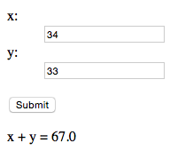

Sebastian Raschka, 2015

Python Machine Learning - Code Examples (Bonus Material)

# A Simple(r) Barebones Flask Webapp Template

A simple Flask app that calculates the sum of two numbers entered in the respective input fields.

You can run the app locally by executing `python app.py` within this directory.

Click [here](https://github.com/rasbt/python-machine-learning-book/raw/master/code/bonus/flask_webapp_ex01/flask_webapp_ex01.zip) to download this example as zip-file.