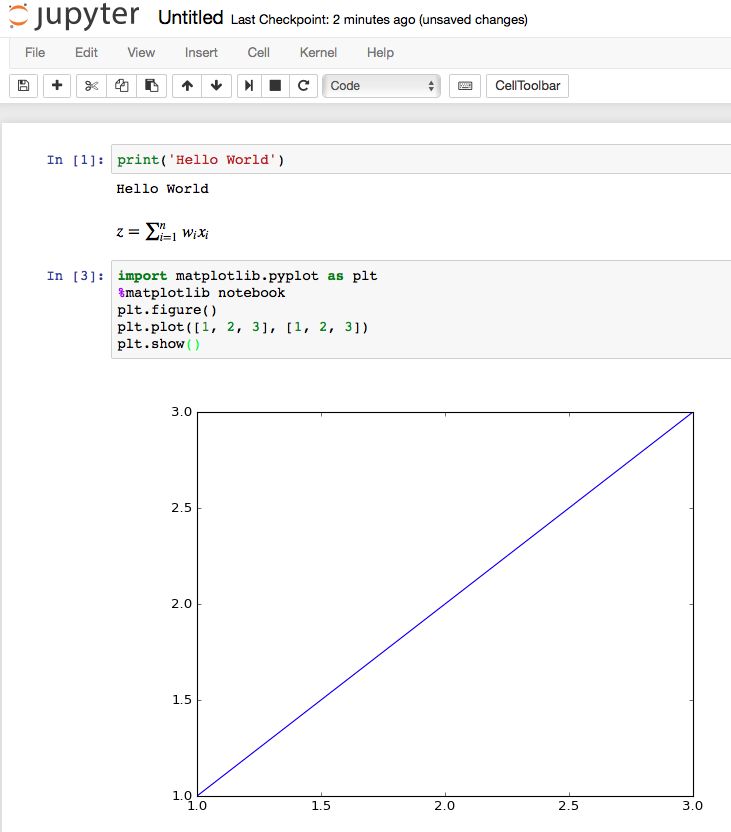
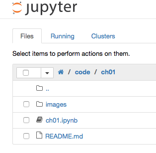

Sebastian Raschka, 2015

Python Machine Learning - Code Examples

##  Chapter 1 - Giving Computers the Ability to Learn from Data

- Building intelligent machines to transform data into knowledge
- The three different types of machine learning
  - Making predictions about the future with supervised learning
    - Classification for predicting class labels
    - Regression for predicting continuous outcomes
  - Solving interactive problems with reinforcement learning
  - Discovering hidden structures with unsupervised learning
    - Finding subgroups with clustering
    - Dimensionality reduction for data compression
- An introduction to the basic terminology and notations
- A roadmap for building machine learning systems
  - Preprocessing – getting data into shape
  - Training and selecting a predictive model
  - Evaluating models and predicting unseen data instances
- Using Python for machine learning
  - Installing Python packages
- Summary

---

**Chapter 1 does not contain any code examples.**

---

## Installing Python packages

Python is available for all three major operating systems — Microsoft Windows, Mac OS X, and Linux — and the installer, as well as the documentation, can be downloaded from the official Python website: https://www.python.org.

This book is written for Python version `>= 3.4.3`, and it is recommended
you use the most recent version of Python 3 that is currently available,
although most of the code examples may also be compatible with Python `>= 2.7.10`. If you decide to use Python 2.7 to execute the code examples, please make sure that you know about the major differences between the two Python versions. A good summary about the differences between Python 3.4 and 2.7 can be found at https://wiki.python.org/moin/Python2orPython3.

**Note**

You can check your current default version of Python by executing

    $ python -V

In my case, it returns

    Python 3.5.1 :: Continuum Analytics, Inc.

#### Pip

The additional packages that we will be using throughout this book can be installed via the `pip` installer program, which has been part of the Python standard library since Python 3.3. More information about pip can be found at https://docs.python.org/3/installing/index.html.

After we have successfully installed Python, we can execute pip from the command line terminal to install additional Python packages:

    pip install SomePackage

(where `SomePackage` is a placeholder for numpy, pandas, matplotlib, scikit-learn, and so forth).

Already installed packages can be updated via the `--upgrade` flag:

    pip install SomePackage --upgrade

#### Anaconda

A highly recommended alternative Python distribution for scientific computing
is Anaconda by Continuum Analytics. Anaconda is a free—including commercial use—enterprise-ready Python distribution that bundles all the essential Python packages for data science, math, and engineering in one user-friendly cross-platform distribution. The Anaconda installer can be downloaded at http://continuum.io/downloads#py34, and an Anaconda quick start-guide is available at https://store.continuum.io/static/img/Anaconda-Quickstart.pdf.

After successfully installing Anaconda, we can install new Python packages using the following command:

    conda install SomePackage

Existing packages can be updated using the following command:

    conda update SomePackage

Throughout this book, we will mainly use NumPy's multi-dimensional arrays to store and manipulate data. Occasionally, we will make use of pandas, which is a library built on top of NumPy that provides additional higher level data manipulation tools that make working with tabular data even more convenient. To augment our learning experience and visualize quantitative data, which is often extremely useful to intuitively make sense of it, we will use the very customizable matplotlib library.

#### Core packages

The version numbers of the major Python packages that were used for writing this book are listed below. Please make sure that the version numbers of your installed packages are equal to, or greater than, those version numbers to ensure the code examples run correctly:

- [NumPy](http://www.numpy.org) 1.9.1
- [SciPy](http://www.scipy.org) 0.14.0
- [scikit-learn](http://scikit-learn.org/stable/) 0.15.2
- [matplotlib](http://matplotlib.org) 1.4.0
- [pandas](http://pandas.pydata.org) 0.15.2

## Python/Jupyter Notebook

Some readers weere wondering about the `.ipynb` of the code files -- these files are IPython notebooks. I chose IPython notebooks over plain Python `.py` scripts, because I think that they are just great for data analysis projects! IPython notebooks allow us to have everything in one place: Our code, the results from executing the code, plots of our data, and documentation that supports the handy Markdown and powerful LaTeX syntax!

**Side Note:**  

"IPython Notebook" recently became the "[Jupyter Notebook](<http://jupyter.org>)"; Jupyter is an umbrella project that aims to support other languages in addition to Python including Julia, R, and many more. Don't worry, though, for a Python user, there's only a difference in terminology (we say "Jupyter Notebook" now instead of "IPython Notebook").

The Jupyter notebook can be installed as usually via pip.

    $ pip install jupyter notebook

Alternatively, we can use the Conda installer if we have Anaconda or Miniconda installed:

    $ conda install jupyter notebook

To open a Jupyter notebook, we `cd` to the directory that contains your code examples, e.g,.

    $ cd ~/code/python-machine-learning-book

and launch `jupyter notebook` by executing

    $ jupyter notebook

Jupyter will start in our default browser (typically running at [http://localhost:8888/](http://localhost:8888/)). Now, we can simply select the notebook you wish to open from the Jupyter menu.

For more information about the Jupyter notebook, I recommend the [Jupyter Beginner Guide](http://jupyter-notebook-beginner-guide.readthedocs.org/en/latest/what_is_jupyter.html).
