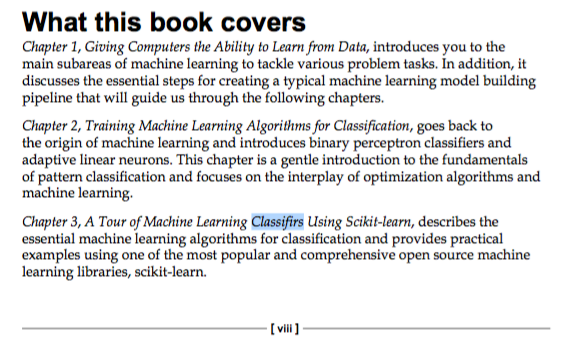

The *Known Errors* Leaderboard
========================

I tried my best to cut all the little typos, errors, and formatting bugs that slipped through the copy editing stage. Even so, I think it is just human to have a little typo here and there in a first edition. I know that this can be annoying as a reader, and I was thinking to associate it with something positive. Let's have a little leaderboard (inspired by Donald Knuth's "[Known Errors in My Books](http://www-cs-faculty.stanford.edu/~uno/books.html)").

**Every error that is not listed in the *Errata* yet will be rewarded with $1.**
The only catch here is that you won't receive any single cent. Instead, I am going to donate the amount to [UNICEF USA](http://www.unicefusa.org), the US branch of the United Nations agency for raising funds to provide emergency food and healthcare for children in developing countries.

I would be happy if you just write me a short [mail](mailto:mail@sebastianraschka.com) including the error and page number, and please let me know if you want to be listed on the public leaderboard.

## Donations

- Current amount for the next donation: $59.00
- Amount donated to charity: $0.00

## Leaderboard

1. Ryan S. ($24.00)
2. Christopher Galpin ($8.00)
2. Edgar C. ($4.00)
3. S.R. ($4.00)
4. Joseph Gordon ($3.00)
5. Ailin M. ($2.00)
6. Ilmo S. ($3.00)
7. Hyun L. ($3.00)
8. T.S. Jayram ($2.00)
9. Andrei R. ($2.00)
10. Panos N. ($2.00)
11. Elias R. ($1.00)
12. Haitham H. Saleh ($1.00)
13. Muqueet M. ($1.00)
14. Renato R. ($1.00)
15. Michael L. ($1.00)

...

# Errata

**I am really sorry about you seeing many typos up in the equations so far. Unfortunately, the layout team needed to retype the equations for compatibility reasons. There were a lot of typos introduced during this process, and I tried my very best to eliminate all of these by comparing the pre-finals against my draft. Cross-comparing 450 pages was a tedious task, and it appears that several typos slipped through, so if you see something that does not make quite sense to you, please let me know.**

### Current Errata:

#### [View Errata on GitHub](./errata/errata_2nd.pdf)

#### [External View Link](http://sebastianraschka.com/pdf/books/pymle/errata_2nd.pdf)

**E-book Update (2015-10-20):**    

Good news! I just heard back from the publisher; all the typos and errors which are listed below will be fixed by next week. If you bought the book via Packt, you'd just need to re-download the book. I hope that the updates will also be reflected in the Amazon Kindle version. If not, please contact me, and I'll be happy to make an arrangement with the publisher so that you'll get the updated e-book.
I am really sorry about the inconvenience, and I really there weren't any errors in the first place. As Alexander Pope once said:

> *to err is human; to forgive, divine*

 I really hope you can overlook these little mishaps, but please do look over the errata, since I really don't want these typos to become misleading!

**How can I tell if I have the initial or updated version of the book?**

The easiest way may be to go to page viii, the second page of the **Preface**. If you see *Classifiers* spelled as *Classifirs*, that's definitely an old version then!

### Old Errata: Sep 23 - Oct 25, 2015

I converted the errata into a PDF document where I highlighted the errors and inserted the corrections as they appear in the book as many readers suggested. Please find the PDF version of the errata below.  
Thanks so much for your feedback so far, I truly appreciate it and will do my best to get this fixed as soon as possible!

#### [View Errata on GitHub](./errata/errata_1st.pdf)

#### [External View Link](http://sebastianraschka.com/pdf/books/pymle/errata_1st.pdf)
