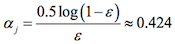

The *Known Errors* Leaderboard
========================

I tried my best to cut all the little typos, errors, and formatting bugs that slipped through the copy editing stage. Even so, I think it is just human to have a little typo here and there in a first edition. I know that this can be annoying as a reader, and I was thinking to associate it with something positive. Let's have a little leaderboard (inspired by Donald Knuth's "[Known Errors in My Books](http://www-cs-faculty.stanford.edu/~uno/books.html)").

**Every error that is not listed in the *Errata* yet will be rewarded with $1.**
The only catch here is that you won't receive any single cent. Instead, I am going to donate the amount to [UNICEF USA](http://www.unicefusa.org), the US branch of the United Nations agency for raising funds to provide emergency food and healthcare for children in developing countries.

I would be happy if you just write me a short [mail](mailto:mail@sebastianraschka.com) including the error and page number, and please let me know if you want to be listed on the public leaderboard.

## Donations

- Current amount for the next donation: $22.00
- Amount donated to charity: $0.00

## Leaderboard

1. Ryan S. ($10.00)
2. S.R. ($4.00)
3. Joseph Gordon ($3.00)
4. T.S. Jayram ($2.00)
5. Elias R. ($1.00)
6. Haitham H. Saleh ($1.00)
7. Muqueet M. ($1.00)

...

# Errata

### Technical Notes

**I am really sorry about you seeing many typos up in the equations so far. Unfortunately, the layout team needed to retype the equations for compatibility reasons. There were a lot of typos introduced during this process, and I tried my very best to eliminate all of these by comparing the pre-finals against my draft. Cross-comparing 450 pages was a tedious task, and it appears that several typos slipped through, so if you see something that does not make quite sense to you, please let me know.**

###[PDF version](./errata.pdf)

**Chapter 2**

- p. 20: Duplication error: Since we brought &theta; to the left, it should be "1 if z &#8805; 0" and not  "1 if z &#8805; &theta;" anymore (Joseph Gordon)
- p. 22:  *y(i)* is set to *1(i)*, rather it should be just *1* (T.S. Jayram)
- p. 25:  The link to `matplotlib` is misspelled, it should be http://matplotlib.org/users/beginner.html instead of http://matplotlib.org/ussers/beginner.html (T.S. Jayram)
- p. 35:  In the context "... update the weights by taking a step away from the gradient &nabla; J(w) ... weight change  &Delta;w defined as the negative gradient multiplied by the earning rate &eta; : &Delta; w = −&eta;&Delta;J(w)."  --> "&Delta;w = −&eta;&Delta;J(w)" should be "&Delta;w = −&eta;&nabla;J(w)" (Ryan S.)

- p. 35: In the section "Minimizing cost functions with gradient descent" we wrote "the update of weight wj as:"  
&Delta; wj = - &eta;     &nabla;J/&nabla;wj = &mu; &sum;i ...   
The &mu; is a typo and it should be  
&Delta; wj = - &eta;     &nabla;J/&nabla;wj = &eta; &sum;i ...  
(Ryan S.)

**Chapter 3**

- p. 60: There is a missing product operator that defines the *likelihood* *L(**w**)* = ...=&prod;ni=1 (&phi;(z)(i))y(i) ... (Elias R.)

- p. 64: In the section "Training a logistic regression model with scikit-learn" where we calculate the partial derivative of the sigmoid function, the equation is printed as   
&part;/ [&part;wj]  * &phi;(z) = &part;/ [&part;z] * 1 / [1 + e-1] ...  
This doesn't make sense of course (note the "&part;wj"), what I meant to write was  
&part;/ [&part;z] * &phi;(z) = &part;/ [&part;z] * 1 / [1 + e-1] ... (Ryan S., Muqueet M.)

**Chapter 5**

- p. 131: In the section "Total and explained variance" I used the [`numpy.linalg.eig`](http://docs.scipy.org/doc/numpy/reference/generated/numpy.linalg.eig.html) function to decompose the symmetric covariance matrix into its eigenvalues and eigenvectors.
    <pre>>>> eigen_vals, eigen_vecs = np.linalg.eig(cov_mat)</pre>
    This is not really a "mistake," but probably suboptimal. It would be better to use [`numpy.linalg.eigh`](http://docs.scipy.org/doc/numpy/reference/generated/numpy.linalg.eigh.html) in such cases, which has been designed for [Hermetian matrices](https://en.wikipedia.org/wiki/Hermitian_matrix). The latter always returns real  eigenvalues; whereas the numerically less stable `np.linalg.eig` can decompose nonsymmetric square matrices, you may find that it returns complex eigenvalues in certain cases. (S.R.)

- p. 143: In the section "Selecting linear discriminants for the new feature subspace," `numpy.linalg.eigh` should be preferred over `np.linalg.eig` for the same reasons as explained above. (S.R.)

- p. 144: I wrote in the Linear Discrimnant section that "Those who are a little more familiar with linear algebra may know that the rank of the d×d-dimensional covariance matrix can be at most *d − 1* ..." Sorry, this is a little bit out of context. First of all, this is only true if *d >> N* (where *d* is the number of dimensions and *N* is the number of samples), and this should have been in the Principal Component Analysis section. Secondly, in context of the Linear Discriminant Analysis, the number of linear discriminants is at most <em>c-1</em> where <em>c</em> is the number of class labels; the in-between class scatter matrix <em>SB</em> is the sum of <em>c</em> matrices with rank 1 or less.</strong> (S.R.)

**Chapter 7**

- p. 227: In the section "Leveraging weak learners via adaptive boosting" we walk "through a more concrete example using a training set consisting of 10 training samples as illustrated in the following table ..." In the rows 7, 8, 9, it should say "No" in the column "Correct?" (Ryan S.)

- p. 227: Related to the error(s) in the table above, the computation of the error was written as  
0.1 &times; 0 + 0.1 &times; 0 + 0.1 &times; 0 + 0.1 &times; 0 + 0.1 &times; 0 + 0.1 &times; 0 +  **0.1 &times; 0 + 0.1 &times; 0 + 0.1 &times; 0** = 0.3  
This should be:  
0.1 &times; 0 + 0.1 &times; 0 + 0.1 &times; 0 + 0.1 &times; 0 + 0.1 &times; 0 + 0.1 &times; 0 + **0.1 &times; 1 + 0.1 &times; 1 + 0.1 &times; 1 + 0.1 &times; 0** = 0.3  
(Ryan S.)

- p. 227: The equation at the bottom
 should be replaced with   
(Ryan S.)

**Chapter 12**

- p. 347: In the section "Introducing the multi-layer neural network architecture" it says "where *h* is the number of hidden units and *m + 1* is the number of hidden units plus bias unit." It should be "the number of **input** units plus bias unit." (Ryan S.)

- p. 348: In the section "Activating a neural network via forward propagation", I wrote "... which passes the origin at z = 0.5, as shown in the following graph:"  
To be correct, *passing through the origin* means passing through the point(0, 0). So, I probably meant to say "which cuts the y-axis at z=0" (Ryan S.)

- p. 366: In the section "Computing the logistic cost function, the generalized cost function (without the regularization term) is written as:
"J(**w**) = - &sum;ni=1 &sum;tk=1 ... "  
Here, the inner &sum;tk=1 should be &sum;tj=1 (Ryan S.)

- p. 369: In the section "Training neural networks via backpropagation" there is another duplication error. The second
      "**&delta;**(2)" in   
      "**&delta;**(2) = (**W**(2))T **&delta;**(2) * [ &part; &phi;(z(2))/  &part; z(2)]"  
      should be "**&delta;**(3)"  so that   
      "**&delta;**(2) = (**W**(2))T **&delta;**(3) * [ &part; &phi;(z(2))/  &part; z(2)]" (Ryan S.)

### Language

**Preface**

- p. viii: At the bottom of this page ("Chapter 3, A Tour of Machine Learning Classifirs Using Scikit-learn") it should be "Classifiers" not "classifirs" (Hamit H. Saleh)

- p. x: the phrase "--whether you want start from..." should be  "--whether you want to start from..." (Joseph Gordon)

**Chapter 2**

- p. 19: there should be a period between "otherwise" and "in" (this is towards the end of the page) (Joseph Gordon)

**Chapter 3**

- p. 89: The *petal with* near the bottom of this page should of course be *petal width* (S.R.)
