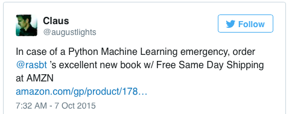
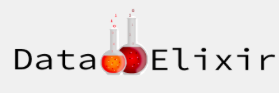
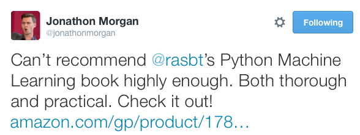
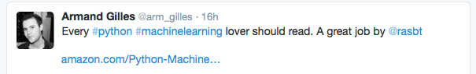
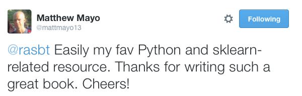
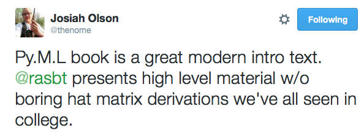

# What do other people think about this book?

When I started writing Python Machine learning, I had 3 big goals in mind:

1. Explaining the concepts well.
2. Providing the mandatory math intuition.
3. Giving practical examples to round up the learning experience and provide the tools for real-world applications.

At least, that was the plan! Whether I was successful or not ... I guess I have to leave this to you, the reader :).
I must honestly say that I was truly relieved and very happy about all the feedback to date. I am positively surprised that I haven't heard anything negative so far; I will take this as a compliment!   

> Fantastic! Both the book and this wonderfully informative blog post! I picked up kindle and print versions of the book last week, downloaded the code from the Packt site, and started going thru it. Superb job! Thus far, for me it seems to have hit the right balance of theory and practice...math and code! [...]     
-- Brian Thomas via [Disqus](http://sebastianraschka.com/blog/2015/writing-pymle.html#comment-2295668894)

> [...] The text contains lots of practical advice as well as inline links to other sources of information. While this book is a good end-to-end read, it would also serve as a useful reference text. Recommended.  
Score: 10 of 10
-- British Computer Society, review by Patrick Hill

Source: [http://www.bcs.org/content/conWebDoc/55586](http://www.bcs.org/content/conWebDoc/55586)

> Technical, but not too much. Let's face it, machine learning algorithms are technical in nature. However, this book allows you to gloss over the actual technical details if you don't really need to understand them right away and view the implementation of the logic in the code snippets. Though, I must say, the presentation of the technical subjects are explained clearly and with supporting graphs and images to help visualize the concepts. It was a wonderful experience to understand the code, even though the theory was also given. This allows most people to jump right in and start writing in python. For the mathematicians out there, you can take the equations and verify them if need be. [...]
The fundamental concepts I've learned have opened the door to an enormous amount of possibilities I could not have even thought of doing had I not read this book. I used to think that true machine learning was only for super geniuses. But now I feel like I have another set of tools I can use to perform nearly superhero tasks. Python Machine Learning will be a reference book I use for many years to come.   
--  Perry Nally on [Amazon](http://www.amazon.com/gp/product/1783555130/ref=s9_simh_gw_p14_d0_i2?pf_rd_m=ATVPDKIKX0DER&pf_rd_s=desktop-1&pf_rd_r=0QKDZ9QNCW8269FMDSQG&pf_rd_t=36701&pf_rd_p=2079475242&pf_rd_i=desktop)

> Sebastian Raschka's new book, Python Machine Learning, has just been released. I got a chance to read a review copy and it's just as I expected - really great! It's well organized, super easy to follow, and it not only offers a good foundation for smart, non-experts, practitioners will get some ideas and learn new tricks here as well.  
-- Lon Riesberg, [Data Elixir Newsletter](http://dataelixir.com/issues/55#start)

> I've purchased and read (virtually) every Machine Learning book that aims to teach the reader the basics of ML using the Scikit-learn library as the main focus. I've found them to be...less than satisfactory. The examples in other books often use ML techniques in contexts for which they are not intended to be used and/or contexts they are not used in out in the real world (among other issues I have found within them).
In stark contrast, Python Machine Learning by Sebastian Raschka is stunningly-impressive, not only for the breadth and depth of coverage, but also in the manner the information is presented to the reader. [...] One of the underlying (though understated) themes in the book is the importance of using visual aids where appropriate to gauge the performance of the algorithms you’re using as well as to understand exactly what is going on behind the scenes, so-to-speak. [...] TL;DR (SUMMARY):
I realize the experience levels described above are subjective. They are present merely to serve as reference points for the readers and to underscore my belief that Python Machine Learning has something for virtually every skill level. I cannot recommend this book more highly!   
-- Jason Wolosonovich on [Amazon](http://www.amazon.com/gp/product/1783555130/ref=s9_simh_gw_p14_d0_i2?pf_rd_m=ATVPDKIKX0DER&pf_rd_s=desktop-1&pf_rd_r=0QKDZ9QNCW8269FMDSQG&pf_rd_t=36701&pf_rd_p=2079475242&pf_rd_i=desktop)

> I just purchased your book/e-book and wanted to thank you for writing a book at this level that combines the theory with the very practical aspects of machine learning [...]. I hope to use it also as a teaching aide for some of my colleagues who work in other areas.   
-- T.S. Jayram, Researcher at the IBM Almaden CS theory group

> This semester, I was assigned to teach a Pattern Recognition course,
your book is the best for me to use as a textbook.  
-- Renyuan Lyu, Associate Professor at Chang Gung University

> I am a big fan of Sebastian Raschka's machine learning tutorials on his personal website, and have found him to be an excellent teacher for complex concepts in ML, so I've been looking forward to reading this book. I found the book similarly well-written and the explanations clear. It is heavy on examples (in Python 3! well done), so it's a good hands-on resource.   
-- Carlos Faham, Security Data Scientist at LinkedIn

> An amazing book, really can't praise it enough. Presentation of technical subjects are explained very clearly. The author is very thorough in his writing making sure to fill in the details so you don't get left behind. It was a wonderful experience. Clearly written examples showing the theory and practice of machine learning. An invaluable tutorial.  
As a bonus, chapter on "Parallelizing Neural Network Training with Theano" was a great addition! A very exciting topic, author really went all out. Hands down the best Python Machine learning book available.  
-- NazHuz via [Amazon](http://www.amazon.com/gp/customer-reviews/RURYHN1G3SRMZ/ref=cm_cr_pr_rvw_ttl?ie=UTF8&ASIN=1783555130)

> I am reading your recent book on ML and I think this is on the best book I ever read on machine learning.  Especially with my background as software developer.  
-- Michaël Lambé

> This is the first Python Machine Learning book that actually made sense. Sebastian managed to combine theory (math behind the models, how to implement an algorithm from scratch) with practice (how to actually implement it using scikit-learn) in a way no book has done thus far. I was really impressed (and surprised) to see how 'easy' it is to implement the more simple algorithms from scratch [...]  
-- C. Herther via [Amazon](http://www.amazon.com/gp/customer-reviews/R2I0D8HNIQODVA/ref=cm_cr_pr_rvw_ttl?ie=UTF8&ASIN=B00YSILNL0)

> This is a great book.
It gives the mathematical definitions of popular machine learning algorithms and shows you how to implement them. Then it explains how to use them with scikit-learn which has much more efficient implementations.
What is great is that this book has chapters on data cleaning, what to do with missing data, etc. Compliments greatly the Andrew Ng's ML course which lacked lectures about all of these things.  
-- Peteris via [Goodreads](https://www.goodreads.com/review/show/1475215520?book_show_action=true&from_review_page=1)

> A great book, it will teach you exactly what it promises - how to use the most common ML algorithms using Python and libraries like sklearn/numpy/pandas.
I found it to have a great balance between the theoretical math and implementation in Python; the split is somewhere around 20/80 in favour of implementation and actually using the algorithms on real data-sets. If you are trying to get a good understanding of the theory, then this book is a good starting point but you will most definitely need to supplement it with something else. I would recommend it even if you have no previous experience with Machine Learning. [...]  
-- Rafal Szymanski via [Goodreads](https://www.goodreads.com/review/show/1514154895?book_show_action=true&from_review_page=1)

> Love it! Clearly written with nice examples. I have a certificate in data science, and was looking for something to fill in the gaps, consolidate and to learn new topics. This book does exactly that. I would recommend to people who are totally new to machine learning, and also those with some background.   
-- Reader via [Amazon](http://www.amazon.com/gp/customer-reviews/R2P8OGDU7XIIL5/ref=cm_cr_pr_rvw_ttl?ie=UTF8&ASIN=B00YSILNL0)

> Absolutely the best machine machine learning book for Python out there. Very clear examples and very well written. The author gives a clear explanation of machine learning algorithms and techniques, as well as going into some of the math and provides code in the form of Juypter notebooks on github. Highly recommended!  
-- David M. Comfort via [Amazon](http://www.amazon.com/gp/customer-reviews/R1KU3VMAU3PY05/ref=cm_cr_pr_rvw_ttl?ie=UTF8&ASIN=1783555130)
