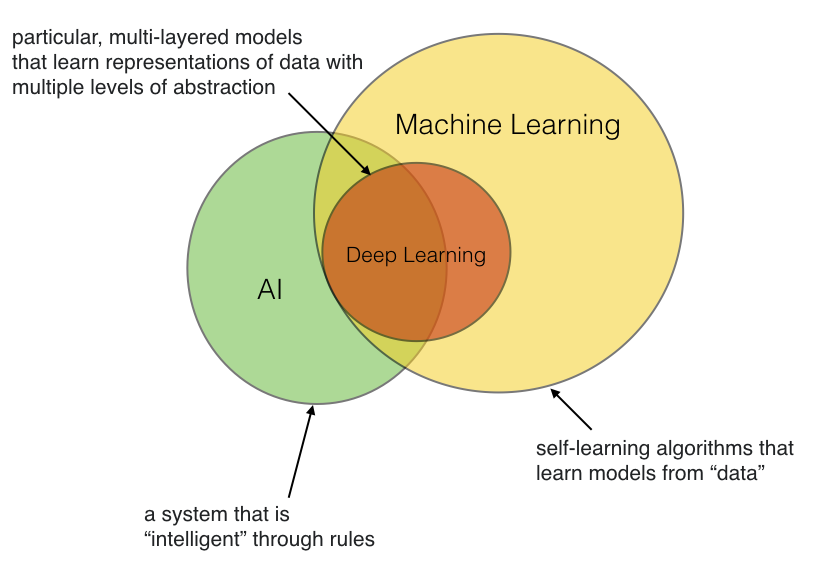

# How are Artificial Intelligence and Machine Learning related?

Artifical Intellicence (AI) started as a subfield of computer science with the focus on solving tasks that humans can but computers can't do (for instance, image recognition). AI can be approached in many ways, for example, writing a computer program that implements a set of rules devised by domain experts. Now, hand-crafting rules can be very labrorious and time consuming.

The field of machine learning -- originally, we can consider it as a subfield of AI -- was concerned with the development of algorithms so that computers can automatically learn (predictive) models from data.

For instance, say we want to develop a program that can recognize handwritten digits from images. One would be to look at all of these images and come-up with a set of (nested) if-this-than-that rules to say which image is displayed in a particular image (for instance, by looking at the relative locations of pixels). Another approach would be to use a machine learning algorithm, which can fit a predictive model based on a thousands of labeled image samples that we may have collected in a database. Now, there's also deep learning, which in turn is a subfield of machine learning, referring to a particular subset of models that are particularly good at certain tasks such as image recognition and natural language processing.

Or in short, machine learning (and deep learning) definitely helps to develop "AI," however, AI doesn't necessarily have to be developed using machine learning -- although, machine learning makes "AI" much more convenient ;).

tldr; to summarize my point of view visually:

