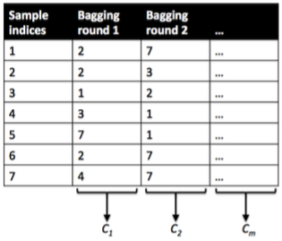
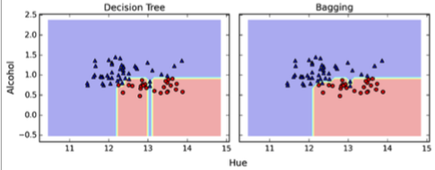
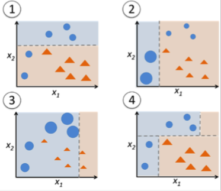
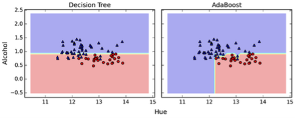

# How does the random forest model work? How is it different from bagging and boosting in ensemble models?

Let's assume we use a decision tree algorithm as base classifier for all three: boosting, bagging, and (obviously :)) the random forest.

Why and when do we want to use any of these? Given a fixed-size number of training samples, our model will increasingly suffer from the "curse of dimensionality" if we increase the number of features. The challenge of individual, unpruned decision trees is that the hypothesis often ends up being too complex for the underlying training data -- decision trees are prone to overfitting.

**tl;dr: Bagging and random forests are "bagging" algorithms that aim to reduce the complexity of models that overfit the training data. In contrast, boosting is an approach to increase the complexity of models that suffer from high bias, that is, models that underfit the training data.**

## Bagging

Now, let's take a look at the probably "simplest" case, bagging. Here, we train a number (ensemble) of decision trees from bootstrap samples of our training set. Bootstrap sampling means drawing random samples from our training set with replacement. E.g., if our training set consists of 7 training samples, our bootstrap samples (here: n=7) can look as follows, where C1, C2, ... Cm shall symbolize the decision tree classifiers:

After we trained our (m) decision trees, we can use them to classify new data via majority rule. For instance, we'd let each decision tree make a decision and predict the class label that received more votes. Typically, this would result in a less complex decision boundary, and the bagging classifier would have a lower variance (less overfitting) than an individual decision tree. Below is a plot comparing a single decision tree (left) to a bagging classifier (right) for 2 variables from the Wine dataset (Alcohol and Hue).

## Boosting

In contrast to bagging, we use very simple classifiers as base classifiers, so-called "weak learners." Picture these weak learners as "decision tree stumps" -- decision trees with only 1 splitting rule. Below, we will refer to the probably most popular example of boosting, AdaBoost. Here, we start with one decision tree stump (1) and "focus" on the samples it got wrong. In the next round, we train another decision tree stump that attempts to get these samples right (2); we achieve this by putting a larger weight on these training samples. Again, this 2nd classifier will likely get some other samples wrong, so we'd re-adjust the weights ...

In a nutshell, we can summarize "Adaboost" as "adaptive" or "incremental"
learning from mistakes. Eventually, we will come up with a model that has a lower bias than an individual decision tree (thus, it is less likely to underfit the training data).

## Random forests

The random forest algorithm is actually a bagging algorithm: also here, we draw random bootstrap samples from our training set. However, in addition to the bootstrap samples, we also draw random subsets of features for training the individual trees; in bagging, we provide each tree with the full set of features. Due to the random feature selection, the trees are more independent of each other compared to regular bagging, which often results in better predictive performance (due to better variance-bias trade-offs), and I'd say that it's also faster than bagging, because each tree learns only from a subset of features.   
