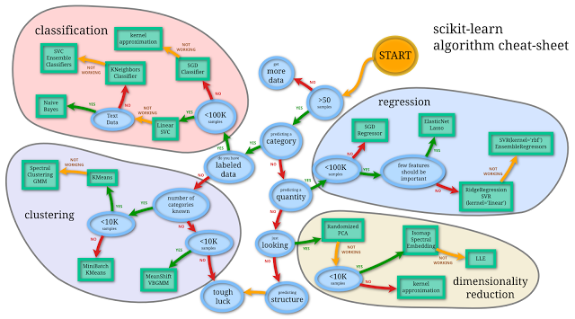

# What factors should I consider when choosing a predictive model technique?

This is a very broad question, and the answer would basically fill an entire book. In a nutshell, I would come up with the

### 1. How does your target variable look like?

- continuous target variable? -> regression
- categorical (nominal) target variable? -> classification
- ordinal target variable? -> ranked classification
- no target variable and want to find structure in data? -> cluster analysis, projection

### 2. Is computational performance an issue?

- use "cheaper" models/algorithms
- dimensionality reduction
- feature selection
- lazy learner (e.g,. k-nearest neighbors)

### 3. Does my dataset fit into memory? If no:

- out of core learning
- distributed systems

### 4. Is my data linearly separable?

- hard to know the answer upfront
- always a good idea to compare different models

### 5. Finding a good bias variance threshold. Does my model overfit?

- increase regularization strength if supported by the model
- dimensionality reduction or feature selection otherwise
- collect more training data if possible (check via learning curves first)

### 6. Are you planning to update your model with new data on the fly?

- one option are lazy learners (e.g., K-nearest neighbors); needs to keep training data around; no learning necessary but more expensive predictions
- it's generally relatively cheap to update generative models
- another option is stochastic gradient descent for online learning

...

The list goes on and on :). I think Andreas Mueller's scikit-learn algorithm "cheat-sheet" is an excellent resource. (Click on the image to view the original, interactive version on scikit-learn)

[Source: http://scikit-learn.org/dev/tutorial/machine_learning_map/index.html]
