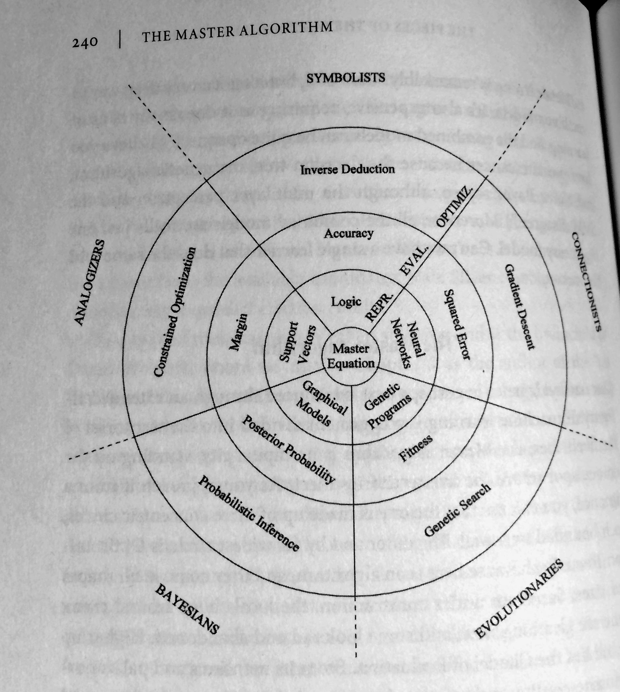

# What are the broad categories of classifiers?

### A (broad) categorization could be "discriminative" vs. "generative" classifiers:

Discriminative algorithms:
- a direct mapping of x -> y
- intuition: "Distinguishing between people who are speaking different languages without actually learning the language"
- e.g., Logistic regression, SVMs, Neural networks, ...

Generative algorithms:
- model how the data was generated (joint probability distributions p(x, y))
- e.g., naive Bayes, Bayesian belief networks, Restricted Boltzmann machines

### Or, we could categorize classifiers as "lazy" vs. "eager" learners:

Lazy learners:
- don't "learn" a decision rule (or function)
- no learning step involved but require to keep training data around
- e.g., K-nearest neighbor classifiers

### A third possibility could be "parametric" vs. "non-parametric"

(in context of machine learning; the field of statistics interprets use terms a little bit differently.)

non-parametric:
- representations grow with the training data size
- e.g., Decision trees, K-nearest neighbors

parametric:
- representations are "fixed"
- e.g., most linear classifiers like logistic regression etc.

### Pedro Domingo's 5 Tribes of Machine Learning

In his new book ([The Master Algorithm](http://www.amazon.com/Master-Algorithm-Ultimate-Learning-Machine/dp/0465065708/ref=sr_1_1?ie=UTF8&qid=1447045562&sr=8-1&keywords=pedro+domingos)), Pedro Domingo's mentioned the 5 tribes of machine learning, which is another nice categorization. Summarizing from the book (pp. 51-53)

**Symbolists**  
- manipulating symbols (like mathematicians replace expressions by expressions), or in other words, using pre-existing knowledge to fill in the missing pieces
- "master algorithm:" inverse deduction

**Connectionists**  
- reverse-engineering a biological brain, i.e., strengthening the connections between neurons
- "master algorithm:" backpropagation

**Evolutionaries**
- whereas connectionism is about fine-tuning the brain, evolution is about creating the brain
- "master algorithm:" genetic programming

**Bayesians**  
- based on probabilistic inference, i.e., incorporating a priori knowledge: certain outcomes are more likely
- "master algorithm:" Bayes' theorem and its derivatives

**Analogizers**  
- generalizing from similarity, i.e., recognizing similarities or in other words: remember experiences (training data) and how to combine them to make new predictions
- "master algorithm:" support vector machine

