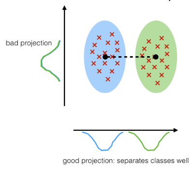
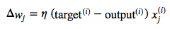
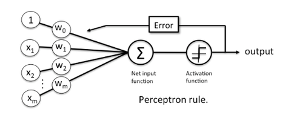
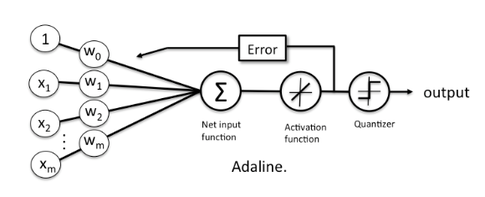

# How was classification, as a learning machine, developed?

There are two fundamental milestones I'd say.
The first one is Fisher's Linear Discriminant [1], later generalized by Rao [2] to what we know as Linear Discriminant Analysis (LDA). Essentially, LDA is a linear transformation (or projection) technique, which is mainly used for dimensionality reduction (i.e., the objective is to find the k-dimensional feature subspace that -- linearly -- separates the samples from different classes best.
Given the objective to maximize class separability, projecting the 2D dataset below onto "x-axis component," would be a better choice than the "y-axis component."

Keep in mind though that LDA is a projection technique; the feature axes of your new feature subspace are (almost certainly) different from your original axes.
In other words, LDA aims to find a new feature subspace that retains most of the class-discriminatory information. Where do I want to go with this? Intuitively, we can come up with a criterion function to minimize the ratio of the distance between the (class) sample means, and the within class scatter. And maximizing our criterion function plus plugging in a threshold function yields us a linear classifier.
Anyway, subjectively, I would group LDA with its closed-form solution into the more classical statistics field (or probabilistic learning if you will due to its relation to ANOVA and Bayes' Theorem).

Another timely take on classification would be the perceptron algorithm, which is in turn based on the concept of the McCulloch-Pitt (MCP) Neuron -- an early (maybe first?) model of how a neuron in a mammal's brain could work [3]. In contrast to the LDA classifier, Rosenblatt's perceptron [4] is an incremental learner. For each training sample, it compares the predicted class labes to the actual class label and modify the model weights accordingly.
Rosenblatt's initial perceptron rule is fairly simple and can be summarized by the following steps:

1. Initialize the weights to 0 or small random numbers.
2. For each training sample x(i):
- Calculate the output value.
- Update the weights.
The value for updating the weights at each increment is calculated by the learning rule

There were few problems with this approach, i.e., the algorithm will never converge if the data is not perfectly separable by a line or hyperplane.
An improvement over the perceptron was the adaptive linear neuron (Adaline) [5]. It is closely related to linear regression (if you use an optimization algorithm like gradient descent rather than the closed-form solution); we update the weights by comparing the real-value output to the actual class label. (Remember, the perceptron algorithms compares the binary-values class labels, i.e., the predicted and actual class labels.) After we trained the model, we use a threshold function to turn the real-valued output into a class label:

A very similar concept is Logistic Regression, however, instead of a linear function, we minimize a logistic function [6]. Again, it wouldn't say the early beginning of logistic regression would be necessarily the "machine learning" approach until incremental learning (gradient descent, stochastic gradient descent, and other optimization algorithms were being used to learn the model weights). In any case, scientists came up with many other cost functions until then, I'd say they are likely inspired by the perceptron, Adaline, and logistic regression.

For example, the hinge loss for SVM. Another direction of the analogizer's SVM approach would be the "connectionism," i.e., combining neuron units to multi-layer neural networks. Although scientists combined Adaline units to multiple Adalines (Madaline), the problem with Adaline was that a combination of linear units is ... well, it's still linear. In any case, there is so much to write about, but I hope that satisfies your curiosity towards the early beginning to some extend.

[1]  Fisher, R. A. (1936). "The Use of Multiple Measurements in Taxonomic Problems". Annals of Eugenics 7 (2): 179–188. doi:10.1111/j.1469-1809.1936.tb02137.x  
[2] Rao, R. C. (1948). "The utilization of multiple measurements in problems of biological classification". Journal of the Royal Statistical Society, Series B 10 (2): 159–203.  
[3] McCulloch, W. and Pitts, W. (1943). A logical calculus of the ideas immanent in nervous activity. Bulletin of Mathematical Biophysics, 5:115–133.  
[4] F. Rosenblatt. The perceptron, a perceiving and recognizing automaton Project Para. Cornell Aeronautical Laboratory, 1957.  
[5] B. Widrow et al. Adaptive ”Adaline” neuron using chemical ”memistors”. Number Technical Report 1553-2. Stanford Electron. Labs., Stanford, CA, October 1960.  
[6] Berkson, Joseph. "Application of the logistic function to bio-assay." Journal of the American Statistical Association 39.227 (1944): 357-365.  
