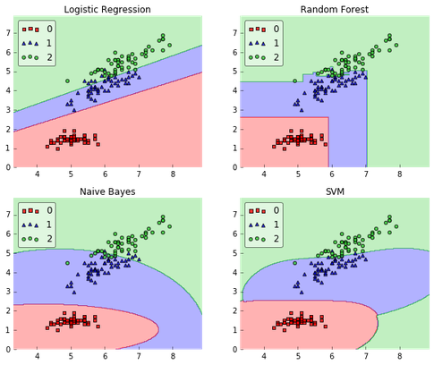
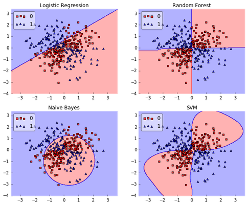
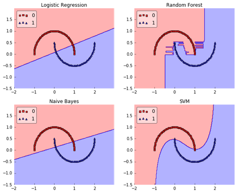
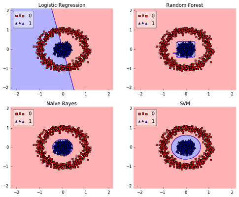

# What are the best toy datasets to help visualize and understand classifier behavior?

The visualization part is a bit tricky since we as humans are limited to 1-3 D graphics. However, I'd still say Iris is one of the most useful toy datasets for looking at classifier behavior (see image below).

(I've implemented this simple function here if you are interested: [mlxtend plot_decision_regions](http://rasbt.github.io/mlxtend/user_guide/plotting/plot_decision_regions/).)
Other than that, I think that synthetic datasets like "XOR," "half-moons," or concentric circles would be good candidates for evaluating classifier on non-linear problems:

