# Fitting a model via closed-form equations vs. Gradient Descent vs Stochastic Gradient Descent vs Mini-Batch Learning. What is the difference?

In order to explain the differences between alternative approaches to estimating the parameters of a model, let's take a look at a concrete example: Ordinary Least Squares (OLS) Linear Regression.
The illustration below shall serve as a quick reminder to recall the different components of a simple linear regression model:

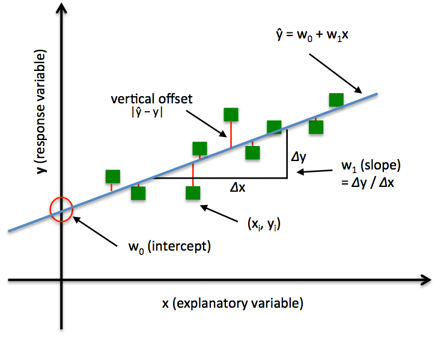

In Ordinary Least Squares (OLS) Linear Regression, our goal is to find the line (or hyperplane) that minimizes the vertical offsets. Or, in other words, we define the best-fitting line as the line that minimizes the sum of squared errors (SSE) or mean squared error (MSE) between our target variable (y) and our predicted output over all samples *i* in our dataset of size *n*.

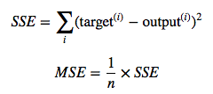

Now, we can implement a linear regression model for performing ordinary least squares regression using one of the following approaches:

- Solving the model parameters analytically (closed-form equations)
- Using an optimization algorithm (Gradient Descent, Stochastic Gradient Descent, Newton's Method, Simplex Method, etc.)

### 1) Normal Equations (closed-form solution)

The closed-form solution may (should) be preferred for "smaller" datasets -- if computing (a "costly") matrix inverse is not a concern. For very large datasets, or datasets where the inverse of **X**T**X** may not exist (the matrix is non-invertible or singular, e.g., in case of perfect multicollinearity), the GD or SGD approaches are to be preferred.
The linear function (linear regression model) is defined as:

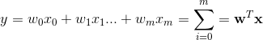

where *y* is the response variable, ***x*** is an *m*-dimensional sample vector, and ***w*** is the weight vector (vector of coefficients). Note that *w0* represents the y-axis intercept of the model and therefore *x0=1*.
Using the closed-form solution (normal equation), we compute the weights of the model as follows:

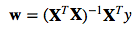

### 2) Gradient Descent (GD)

Using the Gradient Decent (GD) optimization algorithm, the weights are updated incrementally after each epoch (= pass over the training dataset).

The cost function *J(&#8901;)*, the sum of squared errors (SSE), can be written as:

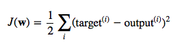

The magnitude and direction of the weight update is computed by taking a step in the opposite direction of the cost gradient

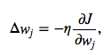

where *&eta;* is the learning rate. The weights are then updated after each epoch via the following update rule:

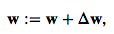

where **&Delta;w** is a vector that contains the weight updates of each weight coefficient *w*, which are computed as follows:

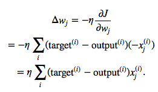

Essentially, we can picture GD optimization as a hiker (the weight coefficient) who wants to climb down a mountain (cost function) into a valley (cost minimum), and each step is determined by the steepness of the slope (gradient) and the leg length of the hiker (learning rate). Considering a cost function with only a single weight coefficient, we can illustrate this concept as follows:

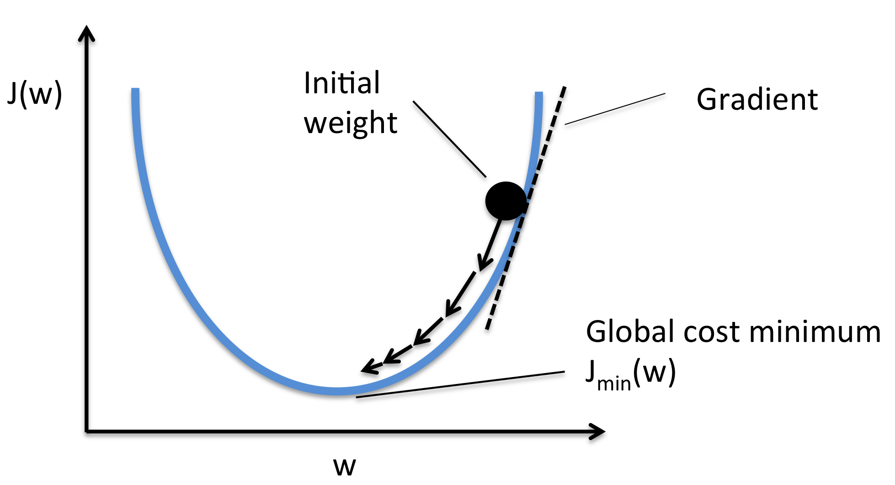

### 3) Stochastic Gradient Descent (SGD)

In GD optimization, we compute the cost gradient based on the complete training set; hence, we sometimes also call it *batch GD*. In case of very large datasets, using GD can be quite costly since we are only taking a single step for one pass over the training set -- thus, the larger the training set, the slower our algorithm updates the weights and the longer it may take until it converges to the global cost minimum (note that the SSE cost function is convex).

In Stochastic Gradient Descent (SGD; sometimes also referred to as *iterative* or *on-line* GD), we **don't** accumulate the weight updates as we've seen above for GD:

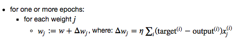

Instead, we update the weights after each training sample:

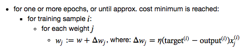

Here, the term "stochastic" comes from the fact that the gradient based on a single training sample is a "stochastic approximation" of the "true" cost gradient. Due to its stochastic nature, the path towards the global cost minimum is not "direct" as in GD, but may go "zig-zag" if we are visualizing the cost surface in a 2D space. However, it has been shown that SGD almost surely converges to the global cost minimum if the cost function is convex (or pseudo-convex)[1].
Furthermore, there are different tricks to improve the GD-based learning, for example:

- An adaptive learning rate &eta; Choosing a decrease constant *d* that shrinks the learning rate over time:
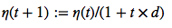

- Momentum learning by adding a factor of the previous gradient to the weight update for faster updates:
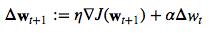

#### A note about shuffling

There are several different flavors of SGD, which can be all seen throughout the literature. Let's take a look at the three most common variants:   

##### A)

- randomly shuffle samples in the training set
    - for one or more epochs, or until approx. cost minimum is reached
        - for training sample *i*
            - compute gradients and perform weight updates

##### B)

- for one or more epochs, or until approx. cost minimum is reached
    - randomly shuffle samples in the training set
        - for training sample *i*
            - compute gradients and perform weight updates

##### C)

- for iterations *t*, or until approx. cost minimum is reached:
    - draw random sample from the training set
        - compute gradients and perform weight updates

In scenario A [3], we shuffle the training set only one time in the beginning; whereas in scenario B, we shuffle the training set after each epoch to prevent repeating update cycles. In both scenario A and scenario B, each training sample is only used once per epoch to update the model weights.

In scenario C, we draw the training samples randomly with replacement from the training set [2]. If the number of iterations *t* is equal to the number of training samples, we learn the model based on a *bootstrap sample* of the training set.

### 4) Mini-Batch Gradient Descent (MB-GD)

Mini-Batch Gradient Descent (MB-GD) a compromise between batch GD and SGD. In MB-GD, we update the model based on smaller groups of training samples; instead of computing the gradient from 1 sample (SGD) or all *n* training samples (GD), we compute the gradient from *1 < k < n* training samples (a common mini-batch size is *k=50*).

MB-GD converges in fewer iterations than GD because we update the weights more frequently; however, MB-GD let's us utilize vectorized operation, which typically results in a computational performance gain over SGD.

### References

- [1] Bottou, Léon (1998). "Online Algorithms and Stochastic Approximations". Online Learning and Neural Networks. Cambridge University Press. ISBN 978-0-521-65263-6
- [2] Bottou, Léon. "Large-scale machine learning with SGD." Proceedings of COMPSTAT'2010. Physica-Verlag HD, 2010. 177-186.
- [3] Bottou, Léon. "SGD tricks." Neural Networks: Tricks of the Trade. Springer Berlin Heidelberg, 2012. 421-436.
