# Why are implementations of decision tree algorithms usually binary and what are the advantages of the different impurity metrics?

For practical reasons (combinatorial explosion) most libraries implement decision trees with binary splits. The nice thing is that they are NP-complete (Hyafil, Laurent, and Ronald L. Rivest. "Constructing optimal binary decision trees is NP-complete." Information Processing Letters 5.1 (1976): 15-17.)

Our objective function (e.g., in CART) is to maximize the information gain (IG) at each split:

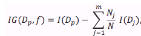

where *f* is the feature to perform the split, and *D_p* and *D_j* are the datasets of the parent and *j*th child node, respectively. *I* is the impurity measure. *N* is the total number of samples, and *N_j* is the number of samples at the *j*th child node.
Now, let's take a look at the most commonly used splitting criteria for classification (as described in CART). For simplicity, I will write the equations for the binary split, but of course it can be generalized for multiway splits. So, for a binary split we can compute *IG* as

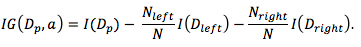

Now, the two impurity measures or splitting criteria that are commonly used in binary decision trees are Gini Impurity(*I_G*) and Entropy (*I_H*) and the Classification Error (*I_E*). Let us start with the definition of Entropy, which is defined as

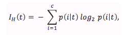

for all “non-empty” classes

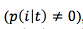

and *p(i|t)* is the proportion of the samples that belong to class *c* for a particular node *t*. The entropy is therefore 0 if all samples at a node belong to the same class, and the Entropy is maximal if we have an uniform class distribution
Intuitively, the Gini Impurity can be understood as a criterion to minimize the probability of misclassification

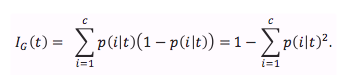

Similar to the Entropy, the Gini Impurity is maximal if the classes are perfectly mixed.
However, in practice both Gini Impurity and Entropy typically yield very similar results and it is often not worth spending much time on evaluating trees using different impurity criteria rather than experimenting with different pruning cut-offs.
Another impurity measure is the Classification Error

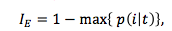

which is a useful criterion for pruning but not recommend for growing a decision tree since it is less sensitive to changes in the class probabilities of the nodes.

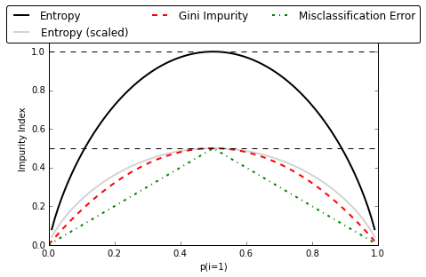

So let me illustrate what I mean by "the classification error is less sensitive to changes in the class probabilities" by looking at the two possible splitting scenarios shown in the figure below.

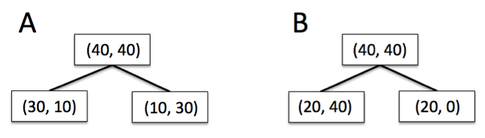

We start with a data set *D_p* at the parent node that consists 40 samples from class 1 and 40 samples from class 2 that we split into two datasets D_left and D_right, respectively. The information gain using the Classification Error as splitting criterion would be the same (*IG_E* = 0.25) in both scenario *A* and *B*:

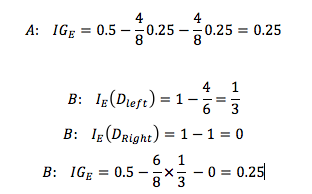

However, the Gini Impurity would favor the split in scenario B (0.1666) over scenario A (0.125), which is indeed more “pure”:

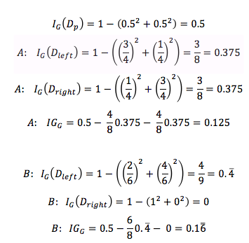

Similarly, the entropy criterion would favor scenario B(IGH = 0.31) over scenario A(IGH = 0.19):

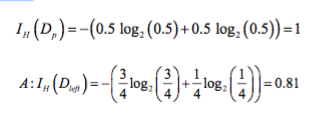

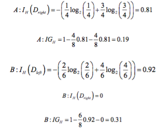

Maybe some more words about Gini vs. Entropy. As mentioned before, the resulting trees are typically very similar in practice. Maybe an advantage of Gini would be that you don't need to compute the log, which can make it a bit faster in your implementation.  
