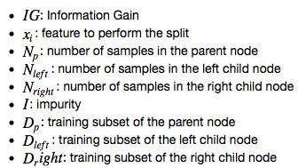
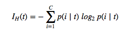
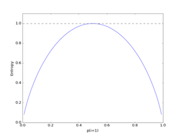
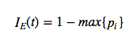
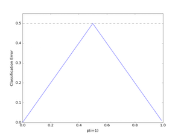
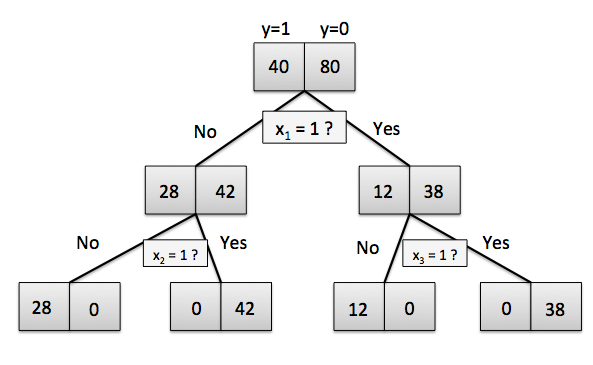
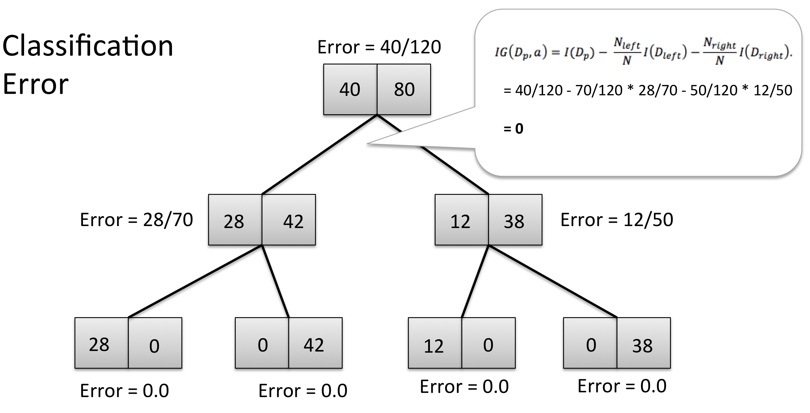
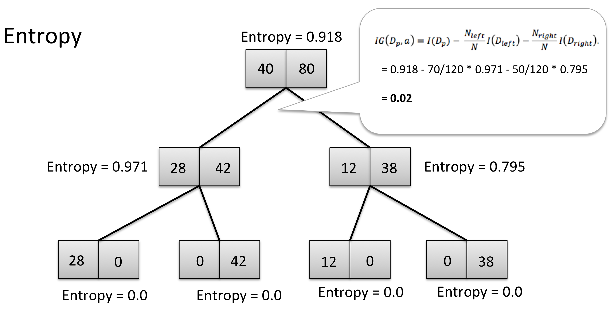
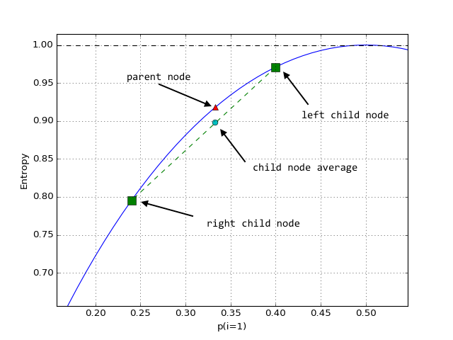

# Why are we growing decision trees via entropy instead of the classification error?

Before we get to the main question -- the real interesting part -- let's take a look at some of the (classification) decision tree basics to make sure that we are on the same page.

##### The Basic Algorithm

1. Start at the root node as parent node
2. Split the parent node at the feature *xi* to minimize the sum of the child node impurities (maximize information gain)
3. Assign training samples to new child nodes
4. Stop if leave nodes are pure or early stopping criteria is satisfied, else repeat steps 1 and 2 for each new child node

##### Stopping Rules

1. The leaf nodes are pure
2. A maximal node depth is reached
3. Splitting a note does not lead to an information gain*

\* This is the important part as we will see later.

##### Impurity Metrics and Information Gain

Formally, we can write the "Information Gain" as

(Note that since the parent impurity is a constant, we could also simply compute the average child node impurities, which would have the same effect.)
For simplicity, we will only compare the "Entropy" criterion to the classification error; however, the same concepts apply to the Gini index as well.

We write the Entropy equation as

for all non-empty classed *p(i | t)* &ne; 0, where *p(i | t)* is the proportion (or frequency or probability) of the samples that belong to class *i* for a particular node *t*; *C* is the number of unique class labels.

Although we are all very familiar with the classification error, we write it down for completeness:

### Classification Error vs. Entropy

Here comes the more interesting part, just as promised. Let's consider the following binary tree starting with a training set of 40 "positive" training samples (y=1) and 80 training samples from the "negative" class (y=0). Further, let's assume that it is possible to come up with 3 splitting criteria (based on 3 binary features x1, x2, and x3) that can separate the training samples perfectly:

Now, is it possible to learn this hypothesis (i.e., tree model) by minimizing the classification error as a criterion function? Let's do the math:

As we can see, the Information Gain after the first split is exactly 0, since average classification error of the 2 child nodes is exactly the same as the classification error of the parent node (40/120 = 0.3333333). In this case, splitting the initial training set wouldn't yield any improvement in terms of our classification error criterion, and thus, the tree algorithm would stop at this point (for this statement to be true, we have to make the assumption that neither splitting on feature x2 nor x3 would lead to an Information gain as well).

Next, let's see what happens if we use Entropy as an impurity metric:

In contrast to the average classification error, the average child node entropy is **not** equal to the entropy of the parent node. Thus, the splitting rule would continue until the child nodes are pure (after the next 2 splits). So, why is this happening? For an intuitive explanation, let's zoom in into the Entropy plot:

The green square-shapes are the Entropy values for p(28/70) and (12/50) of the first two child nodes in the decision tree model above, connected by a green (dashed) line. To recapitulate: the decision tree algorithm aims to find the feature and splitting value that leads to a maximum decrease of the average child node impurities over the parent node.
So, if we have 2 entropy values (left and right child node), the average will fall onto the straight, connecting line.
However **-- and this is the important part --** we can see that the Entropy is always larger than the averaged Entropy due to its "bell shape," which is why we keep continuing to split the nodes in contrast to the classification error.
