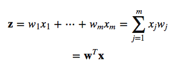
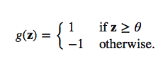
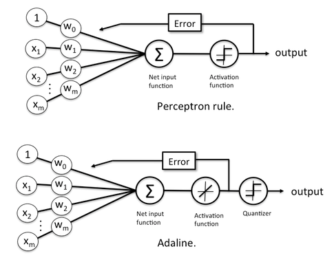
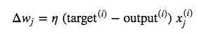
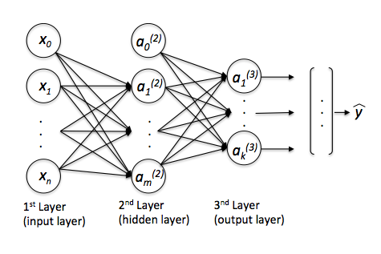
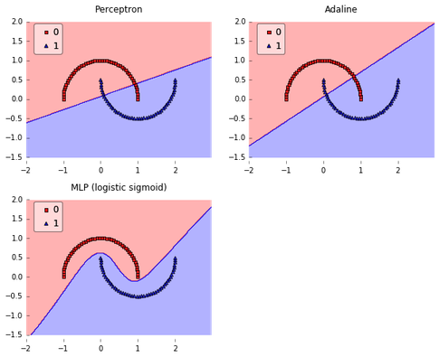

# What is the difference between a Perceptron, Adaline, and neural network model?

Both Adaline and the Perceptron are (single-layer) neural network models.
The Perceptron is one of the oldest and simplest learning algorithms out there, and I would consider Adaline as an improvement over the Perceptron.


### What Adaline and the Perceptron have in common

- they are classifiers for binary classification
- both have a linear decision boundary
- both can learn iteratively, sample by sample (the Perceptron naturally, and Adaline via stochastic gradient descent)
- both use a threshold function

Before we talk about the differences, let's talk about the inputs first. The first step in the two algorithms is to compute the so-called net input *z* as the linear combination of our feature variables *x* and the model weights *w*.




Then, in the Perceptron and Adaline, we define a threshold function to make a prediction. I.e., if *z* is greater than a threshold theta, we predict class 1, and 0 otherwise:




### The differences between the Perceptron and Adaline

- the Perceptron uses the class labels to learn model coefficients
- Adaline uses continuous predicted values (from the net input) to learn the model coefficients, which is more "powerful" since it tells us by "how much" we were right or wrong

So, in the perceptron, as illustrated below, we simply  use the predicted class labels to update the weights, and in Adaline, we use a continuous response:



(Note that I inserted the "activation function" in Adaline just for illustrative purposes; here, this activation function is simply the identity function)
Both learning algorithms can actually be summarized by 4 simple steps -- given that we use stochastic gradient descent for Adaline:

1. Initialize the weights to 0 or small random numbers.
2. For each training sample:
    1. Calculate the output value.
    2. Update the weights.

We write the weight update in each iteration as:


where




Again, the "output" is the continuous net input value in Adaline and the predicted class label in case of the perceptron; eta is the learning rate.
(In case you are interested: This weight update in Adaline is basically just taking the "opposite step" in direction of the sum-of-squared error cost gradient. I've a more detailed walkthrough [here](http://rasbt.github.io/mlxtend/user_guide/general_concepts/linear-gradient-derivative/) on deriving the cost gradient.


### Multi-layer neural networks

Although you haven't asked about multi-layer neural networks specifically, let me add a few sentences about one of the oldest and most popular multi-layer neural network architectures: the Multi-Layer Perceptron (MLP). The term "Perceptron" is a little bit unfortunate in this context, since it really doesn't have much to do with Rosenblatt's Perceptron algorithm.



MLPs can basically be understood as a network of multiple artificial neurons over multiple layers. Here, the activation function is not linear (like in Adaline), but we use a non-linear activation function like the logistic sigmoid (the one that we use in logistic regression) or the hyperbolic tangent, or a piecewise-linear activation function such as the rectifier linear unit (ReLU). In addition, we often use a softmax function (a generalization of the logistic sigmoid for multi-class problems) in the output layer, and a threshold function to turn the predicted probabilities (by the softmax) into class labels.


So, what the advantage of the MLP over the classic Perceptron and Adaline? By connecting the artificial neurons in this network through non-linear activation functions, we can create complex, non-linear decision boundaries that allow us to tackle problems where the different classes are not linearly separable.

Let me show you an example :)




Here's the Python code if you want to reproduce these plots:

```Python
from mlxtend.plotting import plot_decision_regions
from mlxtend.classifier import Perceptron
from mlxtend.classifier import Adaline
from mlxtend.classifier import MultiLayerPerceptron
import numpy as np
import matplotlib.pyplot as plt
from sklearn.datasets import make_moons
import matplotlib.gridspec as gridspec
import itertools

gs = gridspec.GridSpec(2, 2)xw
X, y = make_moons(n_samples=100, random_state=123)
fig = plt.figure(figsize=(10,8))

ppn = Perceptron(epochs=50, eta=0.05, random_seed=0)
ppn.fit(X, y)
ada = Adaline(epochs=50, eta=0.05, random_seed=0)
ada.fit(X, y)

mlp = MultiLayerPerceptron(n_output=len(np.unique(y)),
                           n_features=X.shape[1],
                           n_hidden=150,
                           l2=0.0,
                           l1=0.0,
                           epochs=500,
                           eta=0.01,
                           alpha=0.0,
                           decrease_const=0.0,
                           minibatches=1,
                           shuffle_init=False,
                           shuffle_epoch=False,
                           random_seed=0)

mlp = mlp.fit(X, y)


for clf, lab, grd in zip([ppn, ppn, mlp],
                         ['Perceptron', 'Adaline', 'MLP (logistic sigmoid)'],
                         itertools.product([0, 1], repeat=2)):

    clf.fit(X, y)
    ax = plt.subplot(gs[grd[0], grd[1]])
    fig = plot_decision_regions(X=X, y=y, clf=clf, legend=2)
    plt.title(lab)

plt.show()
```
