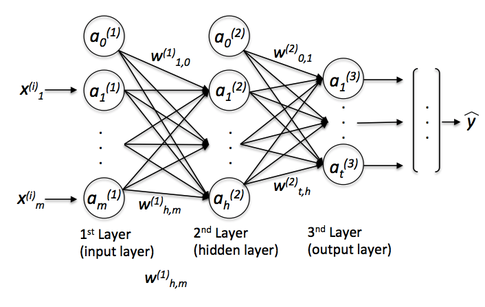
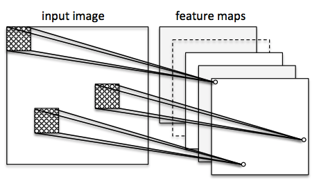
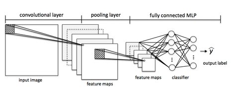

# What is the difference between deep learning and usual machine learning?

That's an interesting question, and I try to answer this is a very general way.
The tl;dr version of this is: Deep learning is essentially a set of techniques that help you to parameterize deep neural network structures, neural networks with many, many layers and parameters.

And if you are interested, a more concrete example:
Let's start with multi-layer perceptrons (MLPs) ...

On a tangent: The term "perceptron" in MLPs may be a bit confusing since you don't really want only linear neurons in your network. Using MLPs, you want to learn complex functions to solve non-linear problems. Thus, your network is conventionally composed of one or multiple "hidden" layers that connect the input and output layer. Those hidden layers normally have some sort of sigmoid activation function (log-sigmoid or the hyperbolic tangent etc.). For example, think of a log-sigmoid unit in your network as a logistic regression unit that returns continuous values outputs in the range 0-1. A simple MLP could look like this

where y_hat is the final class label that you return as the prediction based on the inputs (x) if this are classification tasks. The "a"s are your activated neurons and the "w"s are the weight coefficients.
Now, if you add multiple hidden layers to this MLP, you'd also call the network "deep." The problem with such "deep" networks is that it becomes tougher and tougher to learn "good" weights for this network. When you start training your network, you typically assign random values as initial weights, which can be terribly off from the "optimal" solution you want to find. During training, you then use the popular backpropagation algorithm (think of it as reverse-mode auto-differentiation) to propagate the "errors" from right to left and calculate the partial derivatives with respect to each weight to take a step into the opposite direction of the cost (or "error") gradient. Now, the problem is the so-called "vanishing gradient" -- the more layers you add, the harder it becomes to "update" your weights because the signal becomes weaker and weaker. Since your network's weights can be terribly off in the beginning (random initialization) it can become almost impossible to parameterize a "deep" neural network with backpropagation.
Now, this is where "deep learning" comes into play. Roughly speaking, you can think of deep learning as "clever" tricks or algorithms that can help you with training such "deep" neural network structures. There are many, many different neural network architectures, but to continue with the example of the MLP, let me introduce the idea of convolutional neural networks (ConvNets). You can think of those as an "add-on" to your MLP that helps you to detect features as "good" inputs for your MLP.

Let's consider a ConvNet in context of image classification
Here, you use so-called "receptive fields" (think of them as "windows") that slide over your image. You then connect those "receptive fields" (for example of the size of 5x5 pixel) with 1 unit in the next layer, this is also called "feature map". After you are done with this mapping, you have constructed a so-called convolutional layer. Note that your feature detectors are basically replicates of one another -- they share the same weights. The idea is that if a feature detector is useful in one part of the imagine it is likely that it is useful somewhere else, but at the same time it allows each patch of image to be represented in several ways.

Next, you have a "pooling" layer, where you reduce neighboring features from your feature map into single units (by taking the max feature or by averaging them, for example). You do this over many rounds and eventually arrive at an almost scale invariant representation of your image (the exact term is "equivariant"). This is very powerful since you can detect objects in an image no matter where they are located.

   
