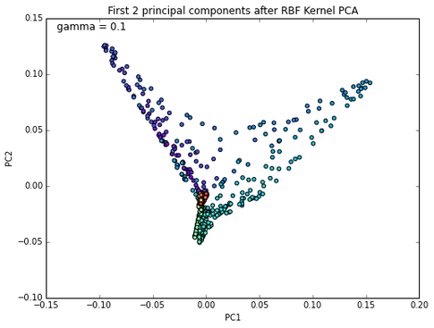
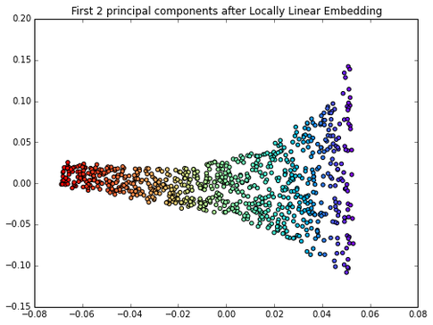

# What are the different dimensionality reduction methods in machine learning?

Since there are so many different approaches, let's break it down to "feature selection" and "feature extraction."

Some examples of feature selection:

- L1 regularization (e.g., Logistic regression) and sparsity
- variance thresholds
- recursive feature elimination based on the weights of linear models
- random forests / extra trees and feature importance (calculated as average information gain)
- sequential forward/backward selection
- genetic algorithms
- exhaustive search

Some examples of feature extraction:

- Principal Component Analysis (PCA), unsupervised, returns axes of maximal variance given the constraint that those axes are orthogonal to each other
- Linear Discriminant Analysis (LDA; not to be confused with Latent Dirichlett Allocation), supervised, returns axes that maximizes class separability (same constraint that axes are also orthogonal); and another article: Linear Discriminant Analysis bit by bit
- kernel PCA: uses kernel trick to transform non-linear data to a feature space were samples may be linearly separable (in contrast, LDA and PCA are linear transformation techniques
- supervised PCA
- and many more non-linear transformation techniques, which you can find nicely summarized here: [Nonlinear dimensionality reduction](https://en.wikipedia.org/wiki/Nonlinear_dimensionality_reduction)

** So, which technique should we use? **

This also follows the "No Lunch Theorem" principle in some sense: there is no method that is always superior; it depends on your dataset. Intuitively, LDA would make more sense than PCA if you have a linear classification task, but empirical studies showed that it is not always the case. Although kernel PCA can separate concentric circles, it fails to unfold the Swiss Rroll, for example; here, locally linear embedding (LLE) would be more appropriate.  

