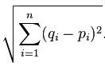
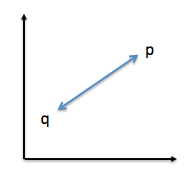

# What is Euclidean distance in terms of machine learning?

It is just a distance measure between a pair of samples *p* and *q* in an *n*-dimensional feature space:

For example, picture it as a "straight, connecting" line in a 2D feature space:

The Euclidean is often the "default" distance used in e.g., K-nearest neighbors (classification) or K-means (clustering) to find the "k closest points" of a particular sample point. Another prominent example is hierarchical clustering, agglomerative clustering (complete and single linkage) where you want to find the distance between clusters.
