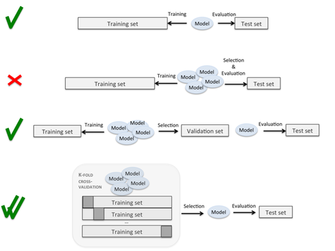
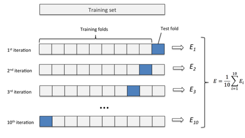

# How do I evaluate a model?

The short answer is to keep an independent test set for your final model -- this has to be data that your model hasn't seen before.

However, it all depends on your goal & approach.

### Scenario 1:

- Just train a simple model.

Split the dataset into a separate test and training set. Train the model on the former, evaluate the model on the latter (by "evaluate" I mean calculating performance metrics such as the error, precision, recall, ROC auc, etc.)

### Scenario 2:

- Train a model and tune (optimize) its hyperparameters.

Split the dataset into a separate test and training set. Use techniques such as k-fold cross-validation on the training set to find the "optimal" set of hyperparameters for your model. If you are done with hyperparameter tuning, use the independent test set to get an unbiased estimate of its performance.
Below I inserted a figure to illustrate the difference:

   

The first row refers to "Scenario 1", and the 3rd row describes a more "classic" approach where you further split your training data into a training subset and a validation set. Then, you train your model on the training subset and evaluate in on the validation set to optimize its hyperparameters, for example. Eventually, you test it on the independent test set. The fourth row describes the "superior" (more unbiased) approach using k-fold cross-validation as described in "Scenario 2."

Also, let me attach an overview of k-fold cross validation in case you are not familiar with it, yet:

   

(Here: E = prediction error, but you can also substitute it by precision, recall, f1-score, ROC auc or whatever metric you prefer for the given task.)

### Scenario 3:

- Build different models and compare different algorithms (e.g., SVM vs. logistic regression vs. Random Forests, etc.).

Here, we'd want to use nested cross-validation. In nested cross-validation, we have an outer k-fold cross-validation loop to split the data into training and test folds, and an inner loop is used to select the model via k-fold cross-validation on the training fold. After model selection, the test fold is then used to evaluate the model performance. After we have identified our "favorite" algorithm, we can follow-up with a "regular" k-fold cross-validation approach (on the complete training set) to find its "optimal" hyperparameters and evaluate it on the independent test set. Let's consider a logistic regression model to make this clearer:
Using nested cross-validation you will train *m* different logistic regression models, 1 for each of the *m* outer folds, and the inner folds are used to optimize the hyperparameters of each model (e.g., using gridsearch in combination with k-fold cross-validation. If your model is stable, these *m* models should all have the same hyperparameter values, and you report the average performance of this model based on the outer test folds. Then, you proceed with the next algorithm, e.g., an SVM etc.

   
