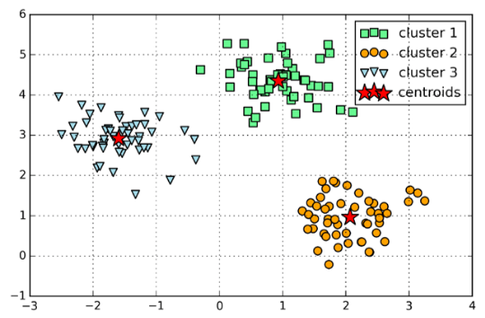
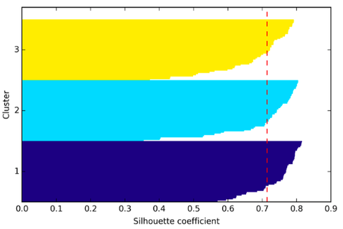
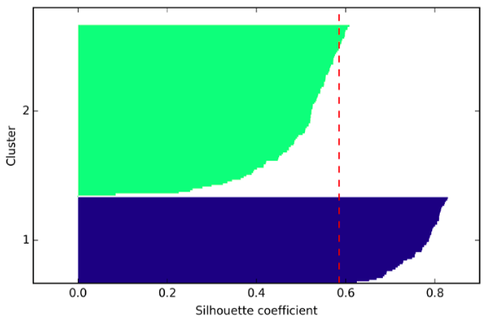

# What are some of the issues with Clustering?

I wouldn't necessarily call most of them "issues" but rather "challenges". For example, *k*-means:

- The different results via *k*-means with distinct random initializations are definitely a problem. However, we could use *k*-means++ as an alternative, and if it's computationally feasible, we want to run your algorithm multiple times with different seeds and pick the one with e.g., lowest within cluster SSE (sum of squared errors)

- The number of clusters is (typically) not known a priori (that's basically the characteristic of unsupervised learning problems), but there are a few "performance" or "evaluation metrics one can use to infer a "satisfying" grouping against the value of K; this is also called the elbow method:

Here, it seems that k=3 would be a good pick. Let's have a look at the accompanying 2D dataset that I used to train the *k*-means algorithm and see if our intuition agrees:

I'd say k=3 is definitely a reasonable pick. However, note that the "elbow" is typically not as clear as shown above. Moreover, note that in practice we normally work with higher-dimensional datasets so that we can't simply plot our data and double-check visually. (We could use unsupervised dimensionality reduction techniques though such as PCA). In fact, if we already knew that the 3 clusters belong to three different groups, this would be a classification task.

Anyway, there are other useful evaluation metrics such as the silhouette coefficient, which gives us some idea of the cluster sizes and shapes. Using the same dataset, let me give you a "good" silhouette plot (with k=3) and a not so decent one (k=2)

I would say that the biggest "shortcoming" in *k*-means may be that we assume that the groups come in spherical or globular shapes, which is rarely the case with "real-world" data. In contrast, I could think of choosing the "optimal" *k* as just another hyperparameter optimization procedure, which is also necessary for almost every supervised learning algorithm.   
