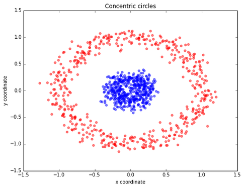
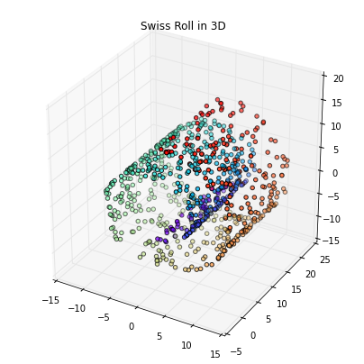
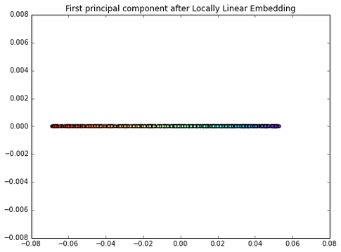

# How do you attack a machine learning problem with a large number of features?

There are 3 main strategies to reduce the number of features if necessary to avoid overfitting (due to the curse of dimensionality) and/or reduce the computational complexity (i.e., increase the computational efficiency).

**1) Regularization and Sparsity**

- If supported by the model, I would recommend L1 or ElasticNet regularization to zero-out some features.

**2) Feature Selection**

- We could try various different feature selection algorithms (e.g., selecting by variance or by greedy search: sequential backward/forward selection, genetic algorithms, etc.)

**3) Feature Extraction**

- We could compress your feature space via transformation onto a lower-dimensional subspace. One popular example would be Principal Component Analysis. But we have to keep in mind that PCA is a linear transformation technique, which may be problematic in non-linear problems. For example, let's consider a simple "concentric circles" dataset:

Let's assume the blue samples belong to one class, and the red circles belong to a second class. Our goal is to train a model for classification. Furthermore, we assume that this dataset has too many dimensions (okay, we only have 2 features here, but we need to keep it "simple" for visualization purposes). Now, we want to compress the data onto a lower-dimensional subspace, here: 1 dimension.
Let's start with "standard" PCA. Can you spot the problem?

The two classes are not separable anymore...
Let's use kernel PCA:

This is much better; we can now train a linear classifier to separate those two classes. However, the problem is that we introduce an additional hyperparameter (gamma) that needs to be tuned. Also, this "kernel trick" does not work for any dataset, and there are also many more manifold learning techniques that are "more powerful"/appropriate than kernel PCA.
For example, locally linear embedding (LLE) to unfold the famous Swiss Roll:

   
