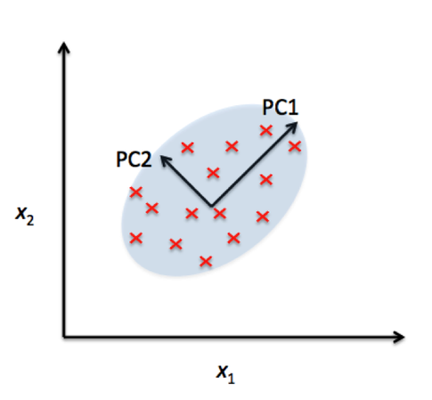
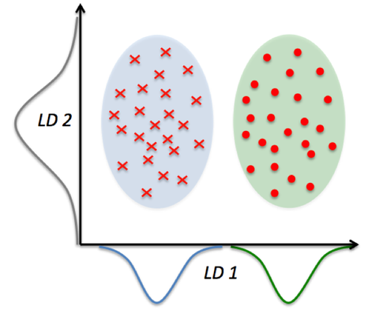

# What is the difference between LDA and PCA for dimensionality reduction?

Both LDA and PCA are linear transformation techniques: LDA is a supervised whereas PCA is unsupervised -- PCA ignores class labels.

We can picture PCA as a technique that finds the directions of maximal variance:

In contrast to PCA, LDA attempts to find a feature subspace that maximizes class separability (note that LD 2 would be a very bad linear discriminant in the figure above).

Remember that LDA makes assumptions about normally distributed classes and equal class covariances.
If you are interested in an empirical comparison: A. M. Martinez and A. C. Kak. PCA versus LDA. Pattern Analysis and Machine Intelligence, IEEE Transactions on, 23(2):228–233, 2001). (PCA tends to result in better classification results in an image recognition task if the number of samples for a given class was relatively small.)
