

# How do you derive the Gradient Descent rule for Linear Regression and Adaline?

Linear Regression and Adaptive Linear Neurons (Adalines) are closely related to each other. In fact, the Adaline algorithm is a identical to linear regression except for a threshold function 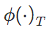 that converts the continuous output into a categorical class label

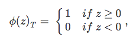

where $z$ is the net input, which is computed as the sum of the input features **x** multiplied by the model weights **w**:

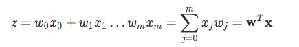

(Note that 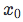 refers to the bias unit so that 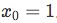.)

In the case of linear regression and Adaline, the activation function 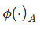 is simply the identity function so that 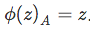.

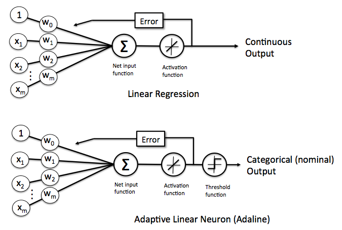

Now, in order to learn the optimal model weights **w**, we need to define a cost function that we can optimize. Here, our cost function 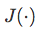 is the sum of squared errors (SSE), which we multiply by 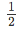 to make the derivation easier:

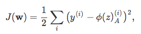

where 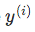 is the label or target label of the *i*th training point 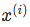.

(Note that the SSE cost function is convex and therefore differentiable.)

In simple words, we can summarize the gradient descent learning as follows:

1. Initialize the weights to 0 or small random numbers.
2. For *k* epochs (passes over the training set)
    3. For each training sample 
        - Compute the predicted output value 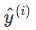
        - Compare  to the actual output 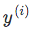 and Compute the "weight update" value
        - Update the "weight update" value
    4. Update the weight coefficients by the accumulated "weight update" values

Which we can translate into a more mathematical notation:

1. Initialize the weights to 0 or small random numbers.
2. For *k* epochs
    3. For each training sample 
        - 
        - 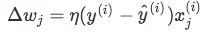  (where *&eta;* is the learning rate);
        - 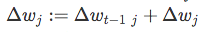  
    3. 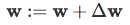

Performing this global weight update

,

can be understood as "updating the model weights by taking an opposite step towards the cost gradient scaled by the learning rate *&eta;*"

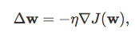

where the partial derivative with respect to each 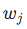 can be written as

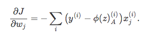

To summarize: in order to use gradient descent to learn the model coefficients, we simply update the weights **w** by taking a step into the opposite direction of the gradient for each pass over the training set -- that's basically it. But how do we get to the equation

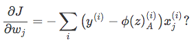

Let's walk through the derivation step by step.

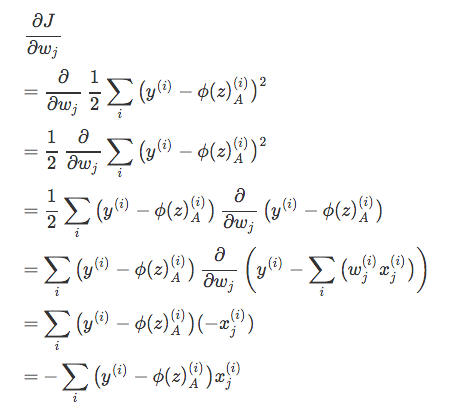
