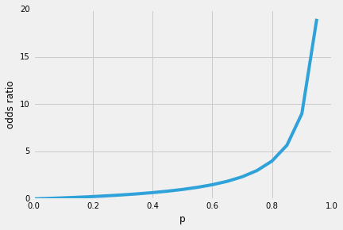
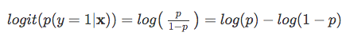
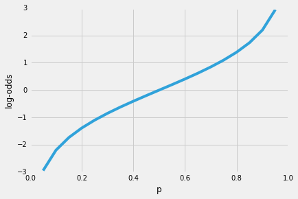
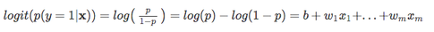
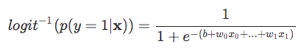
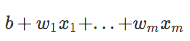
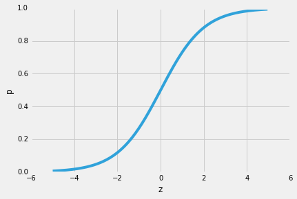

# Logistic Regression: Why sigmoid function?

So, one of the nice properties of logistic regression is that the sigmoid function outputs the conditional probabilities of the prediction, the class probabilities. How does it work?
Let's start with the so-called "odds ratio" *p / (1 - p)*, which describes the ratio between the probability that a certain, positive, event occurs and the probability that it doesn't occur -- where positive refers to the "event that we want to predict", i.e., *p(y=1 | x)*.

(Note that logistic regression a special kind of sigmoid function, the logistic sigmoid; other sigmoid functions exist, for example, the hyperbolic tangent).

So, the more likely it is that the positive event occurs, the larger the odds' ratio.
Now, if we take the natural log of this odds' ratio, the log-odds or logit function, we get the following

Next, let's use this *log transformation* to model the relationship between our explanatory variables and the target variable:

Now, keep it mind that we are not trying to predict the right part of the equation above, since *p(y=1|x)* is what we are really interested in. So, let's take the inverse of this logit function ... et viola, we get the logistic sigmoid:

which returns the class probabilities  *p(y=1|x)* from the inputs

