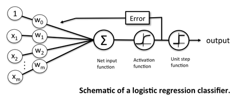
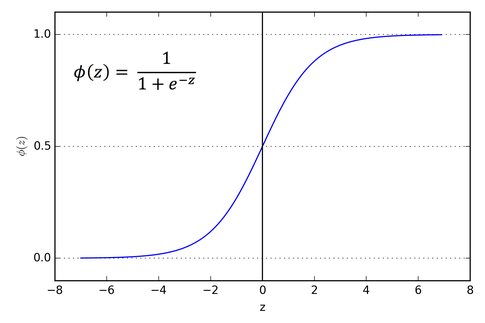
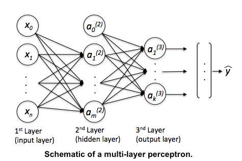
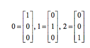
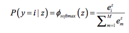
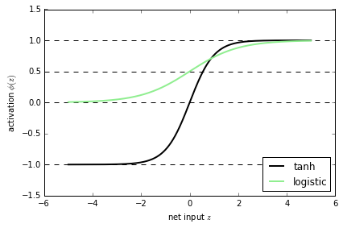

# What is the relation between Logistic Regression and Neural Networks and when to use which?

The "classic" application of logistic regression model is binary classification. However, we can also use "flavors" of logistic to tackle multi-class classification problems, e.g., using the One-vs-All or One-vs-One approaches, via the related softmax regression / multinomial logistic regression.
Although there are kernelized variants of logistic regression exist, the standard "model" is a linear classifier. Thus, logistic regression is useful if we are working with a dataset where the classes are more or less "linearly separable." For "relatively" very small dataset sizes, I'd recommend comparing the performance of a discriminative Logistic Regression model to a related Naive Bayes classifier (a generative model) or SVMs, which may be less susceptible to noise and outlier points. Even so, logistic regression is a great, robust model for simple classification tasks; the March Madness prediction contest this year was one by 2 professors using a logistic regression model

> Professors Lopez and Matthews didn’t use any of the au courant methods in data science circles, either: no deep learning, no hierarchical clustering, no compressed sensing; just a good old model called logistic regression, which turns a number (like a point spread) into an estimated probability that team A will beat team B.
([The Math of March Madness](http://www.nytimes.com/2015/03/22/opinion/sunday/making-march-madness-easy.html?_r=0))

Neural networks are somewhat related to logistic regression. Basically, we can think of logistic regression as a one layer neural network.

In fact, it is very common to use logistic sigmoid functions as activation functions in the hidden layer of a neural network -- like the schematic above but without the threshold function.

It's fine to use the threshold function in the output layer if we have a binary classification task (in this case, you'd only have one sigmoid unit in the output layer). In the case of multi-class classification, we can use a generalization of the One-vs-All approach; i.e., we encode your target class labels via one-hot encoding.

For example, we would encode the three class labels in the familiar Iris dataset (0=Setosa, 1=Versicolor, 2=Virginica) as follows:

Then, for the prediction step after learning the model, we just return the "argmax," the index in the output vector with the highest value as the class label. That's fine if we are only interested in the class label prediction. Now, if we want "meaningful" class probabilities, that is, class probabilities that sum up to 1, we could use the softmax function (aka "multinomial logistic regression"). In softmax, the probability of a particular sample with net input *z* belongs to the i th class can be computed with a normalization term in the denominator that is the sum of all *M* linear functions:

Although, I mentioned that neural networks (multi-layer perceptrons to be specific) may use logistic activation functions, the hyperbolic tangent (tanh) often tends to work better in practice, since it's not limited to only positive outputs in the hidden layer(s).

Anyway, going back to the logistic sigmoid. One of the nice properties of logistic regression is that the logistic cost function (or max-entropy) is convex, and thus we are guaranteed to find the global cost minimum. But, once we stack logistic activation functions in a multi-layer neural network, we'll lose this convexity. Looking only at a single weight / model coefficient, we can picture the cost function in a multi-layer perceptron as a rugged landscape with multiple local minima that can trap the optimization algorithm:

However, in practice, backpropagation works quite well for 1 or 2 layer neural networks (and there are deep learning algos such as autoencoders) to help with deeper architectures. Even if you may likely converge to a local minima, you often still end up with a powerful predictive model.
So, in summary, I would recommend to approach a classification problem with simple models first (e.g., logistic regression). In some cases, this may already solve your problem sufficiently well. However, if you are not satisfied with it's performance and you have sufficient training data, I'd try to train a computationally more expensive neural network, which has the advantage to learn more complex, non-linear functions.   

 
