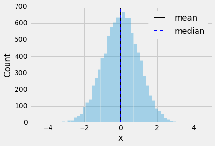
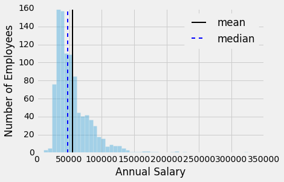

# When should one use median, as opposed to the mean or average?

It really depends on the distribution of the data and the question you are trying to address.

Consider a symmetric distribution (here, I've drawn 10,000 random samples from a standard normal distribution):

In this case, the median and mean will be very similar (mean≈0.00337, median≈0.01690). In fact, the median and mean will be the same if your data sample is perfectly symmetrical distributed, for example, consider [1, 3, 5] or [1, 3, 3, 5].

Now, if you data is skewed, you are likely more interested in computing the median, which is less susceptible to outliers and extreme values. Let's consider a classic examples "salaries." Here, I plotted [FGCU salary dataset from OpenData](https://opendata.socrata.com/dataset/FGCU-salary-dataset/fjqw-ymup):

As we can see, there is a substantial difference between the mean and median value.  Here, the mean picks up the relatively high but infrequent salaries at > 15,000.

Again, it depends on the question you are asking of the data, however, if you question is "what is the average salary" in terms of "what is the typical salary of an employee," then median would be a much better measure than the mean.
