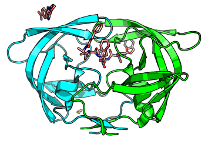
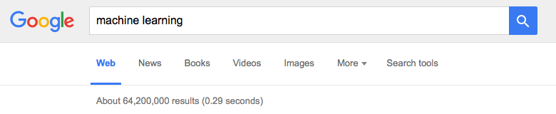
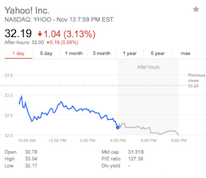

# What are some real-world examples of applications of machine learning in the field?

In our time and age, it is really hard to find a problem where machine learning is not already applied -- machine learning is practically everywhere, in business applications and science. Below is a short list of the maybe most common and intuitive examples:

### Computational Biology & Drug Discovery/Design


- screening large molecule databases and identify which (drug-like) molecules are likely binding to a particular receptor protein
- predict the potency of a receptor agonist or antagonist

(In the figure above, I rendered a crystal structure HIV protease and some potential inhibitors, PDB Code: 4TVH)

Some interesting papers if you want to read more:

- Tarca, Adi L., et al. "Machine learning and its applications to biology." PLoS Comput Biol 3.6 (2007): e116.
(http://journals.plos.org/ploscompbiol/article?id=10.1371/journal.pcbi.0030116)

- Lavecchia, Antonio. "Machine-learning approaches in drug discovery: methods and applications." Drug discovery today 20.3 (2015): 318-331.
(http://www.sciencedirect.com/science/article/pii/S1359644614004176)

### Web Search and Recommendation Engines:

- find recognize input, find relevant searches, predict which results are most relevant to us, return a ranked output
- recommend similar products (e.g., Netflix, Amazon, etc.)



### Finance

- predict if an applicant is credit-worthy  

- detect credit card fraud
- find promising trends on the stock market

### Text and Speech Recognition

- handwritten digit and letter recognition at the post office
- voice assistants (Siri)  
- language translation services  

(Source: https://en.wikipedia.org/wiki/Handwriting_recognition)

### Space, Astronomy, and Robotics

- autonomous Mars robots
- identification of relevant information (objects) in large amounts of Astronomy data

(Source: https://en.wikipedia.org/wiki/Star)

### Social Networks and Advertisement

- data mining of personal information
- selecting relevant ads to show

