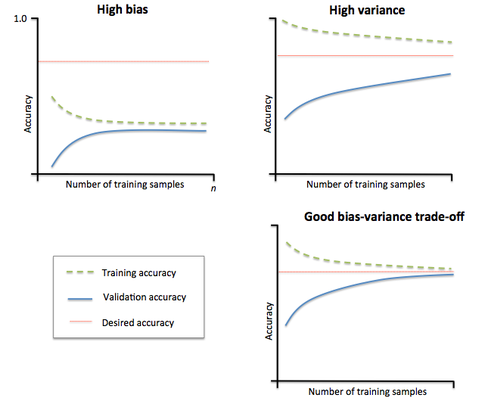
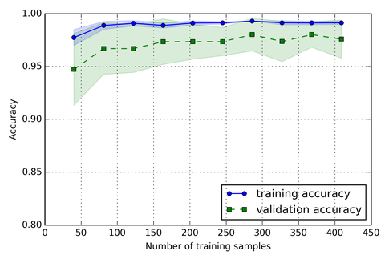

# How do I know if the problem is solvable through machine learning?

In general, most ML algorithm assume that our training samples are i.i.d. Since we want your training set to be representative of the population, we need to divide it into training and test sets randomly.

Also, we want to use our test set only once; we don't want retrain your model and evaluate it on the random test set over and over again,  or our estimate will be hugely overoptimistic otherwise. We should use k-fold cross-validation or nested cross-validation instead.

There are many different reasons why our performance may be not satisfactory:

- our data is skewed
- there is a lot of noise
- there are many outliers
- our features are not informative enough
- we don't have enough training samples

In brief: our algorithm suffers from high variance (overfitting) or high bias (underfitting).

It may help to get a better grasp of our problem by plotting "learning curves"

For example, here I plotted the average accuracies of a model (using 10-fold cross validation). The blue line (training accuracy) shows the average accuracy on the training folds and the green line shows the average accuracy on the test fold  for different sizes of the initial training set.

Similarly, we can evaluate a the model performance for a particular tuning parameter (here, I plotted different values for C, the inverse regularization parameter of an SVM).

