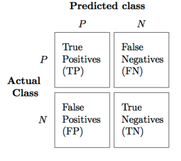
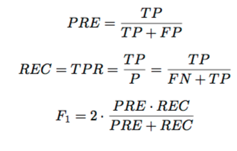
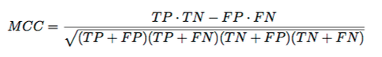
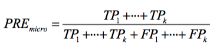
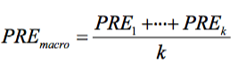

# What is the best validation metric for multi-class classification?

It really depends on our "goal" and our dataset. Classification Accuracy (or misclassification error) makes sense if our class labels are uniformly distributed. Even better, we can compute the ROC area under the curve (even for multi-class sytems), e.g., have a look at the nice [ICML'04 tutorial](http://www.cs.bris.ac.uk/~flach/ICML04tutorial/) on ROC analysis.
Similarly, we can generalize all the binary performance metrics such as precision, recall, and F1-score etc. to multi-class settings. In the binary case, we have

(PRE=precision, REC=recall, F1=F1-Score, MCC=Matthew's Correlation Coefficient)
And to generalize this to multi-class, assuming we have a One-vs-All (OvA) classifier, we can either go with the "micro" average or the "macro" average. In "micro averaging," we'd calculate the performance, e.g., precision, from the individual true positives, true negatives, false positives, and false negatives of the the k-class model:

And in macro-averaging, we average the performances of each individual class:

  
