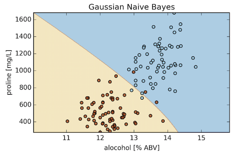
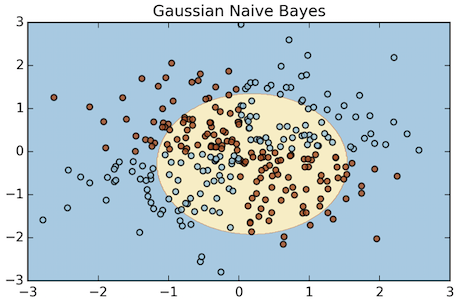

# What is the decision boundary for Naive Bayes?

It's a (piecewise) quadratic decision boundary for the Gaussian model. The multinomial model has a linear boundary.
Below, I plotted some examples:

1) UCI Wine Dataset

2) An XOR toy dataset

