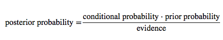
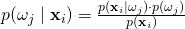
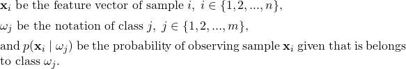
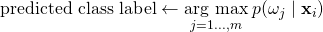
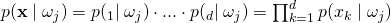
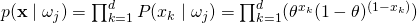
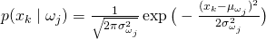
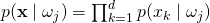
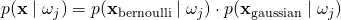

# Is it possible to mix different variable types in Naive Bayes, for example, binary and continues features?

Yes, this is definitely possible.

Let's briefly recapitulate the concept behind Naive Bayes: Our objective function is to maximize the posterior probability given the training data:

Let

And based on the objective function, we can formulate the decision rule as:

In the context of this question, let's not worry about the priors for now; these are typically computed via Maximum Likelihood Estimation (MLE), for instance, the class frequency N&omega;j/N (number of samples in class &omega;j divided by the number of all samples in the training set).

A short note about the evidence term: I wrote it for completeness, but we can simple cancel it from the decision function, because it is a constant term for all classes.
Now, the class-conditional probabilities, let's call them likelihoods, are computed as the product of the likelihoods of the individual features *d*:

Here, we make the "naive" conditional independence assumption, which states that features are independent of each other -- that's how Naive Bayes got its name. What we are basically saying is "The probability of observing this combination of features is equal to the product of observing each feature separately."

Another assumption that we make is that *p(xi = b | &omega;j )* is drawn from a particular distribution -- that's why Naive Bayes is also called a "generative model."
To come back to the original question, let us consider the multi-variate Bernoulli model for binary features and the Gaussian Naive Bayes model for continuous features.

#### The (Multi-variate) Bernoulli Model

We use the Bernoulli distribution to compute the likelihood of a binary variable.
For example, we could estimate P(xk=1 | &omega;j) via MLE as the frequency of occurences in the training set:
&theta; = P&#770;(xk=1 | &omega;j) = Nxk, &omega;j / N &omega;j  
which reads "number of training samples in class &omega;j that have the property xk=1 (Nxk, &omega;j) divided by by all training samples in &omega;j (N &omega;j)." In context of text classification, this is basically the set of documents in class &omega;j that contain a particular word divided by all documents in &omega;j.
Now, we can compute the likelihood of the binary feature vector **x** given class &omega;j as

#### The Gaussian Model

Typically, we use the Gaussian Naive Bayes model for variables on a continuous scale -- assuming that our variables are normal distributed.

In the equation above, we have 2 parameters we need to estimate, the mean &mu; of the samples associated with class &omega;j and the variance &sigma;2 associated with class &omega;j, respectively. This should be straight-forward, so let's skip the details here. After we plugged the estimated parameters into the equation, we can compute the likelihood of a continuous feature vector as (similar to the Bernoulli model above).

Since we have the conditional independence assumption in Naive Bayes, we see that mixing variables is not a problem. We can compute the likelihoods of binary variables via Bernoulli Bayes and compute the likelihoods of the continuous variables via the Gaussian model. To compute the class-conditional probability of a sample, we can simply form the product of the likelihoods from the different feature subsets:

   

(The same concept applies to Multinomial Naive Bayes and other models.)
