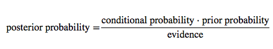
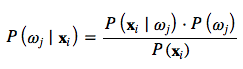
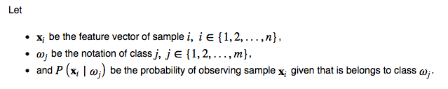
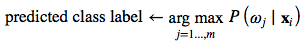
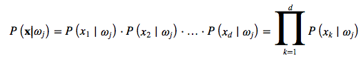

# Why is the Naive Bayes Classifier naive?

Let's start by taking a quick look at the Bayes' Theorem:

In context of pattern classification, we can express it as

If we use the Bayes Theorem in classification, our goal (or objective function) is to maximize the posterior probability

Now, let's talk a bit more about the individual components. The priors are representing our expert (or any other prior) knowledge; in practice, the priors are often estimated via MLE (computed as class frequencies). The evidence term cancels because it is constant for all classes.

Moving on to the "naive" part in the Naive Bayes Classifier: What makes it "naive" is that we compute the conditional probability (sometimes also called likelihoods) as the product of the individual probabilities for each feature:

Since this assumption (the absolute independence of features) is probably never met in practice, it's the truly "naive" part in naive Bayes.
