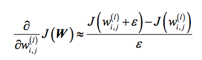
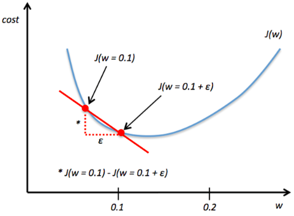
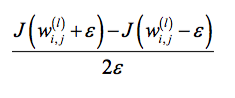
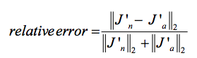
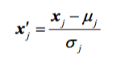

# What is wrong when my neural network's error increases?

There are many possible reasons that could explain this problem. There could be a technical explanation -- we implemented backpropagation incorrectly -- or, we chose a learning rate that was too high, which in turn let to the problem that we were overshooting the local minima of the cost function.

#### Gradient Checking

The first thing I would always do is implementing "gradient checking" to make sure that the implementation is correct. Gradient checking is very easy to implement, and it is a good first diagnostic; here, we just compare the analytical solution to a numerically approximated gradient

(Note that &epsilon; is just a small number around 1e-5 or so.)

Even better yet is to use the 2-point solution with +/- &epsilon;

Then, we compare this numerically approximated gradient to our analytical gradient:

Depending on the complexity of our network architecture, we could come up with some criteria like this:

- Relative error <= 1e-7: everything is okay!
- Relative error <= 1e-4: the condition is problematic, and we should
look into it.
- Relative error > 1e-4: there is probably something wrong in our code

#### Scaling and Shuffling

Next, we want to check if the data has been scaled appropriately. E.g., if we use stochastic gradient descent and initialized our weights to small random numbers around zero, let's make sure that the features are standardized accordingly (mean = 0 and std deviation=1, which are the properties of a standard normal distribution).

Also, let's make sure that we are shuffling the training set prior to every pass over the training set to avoid cycles in stochastic gradient descent.

#### Learning Rate

Eventually, we want to look at the learning rate itself. If the calculated cost increases over time, this could simply mean that we are constantly overshooting the local minima. Besides lowering the learning rate, there are a few tricks that I often add to my implementation:

1. a decrease constant d for an adaptive learning rate; in adaptive learning, we shrink learning rate &eta; over time: &eta; / [1 + t * d ], where t is the time step
2. a momentum factor for faster initial learning based on the previous gradient

