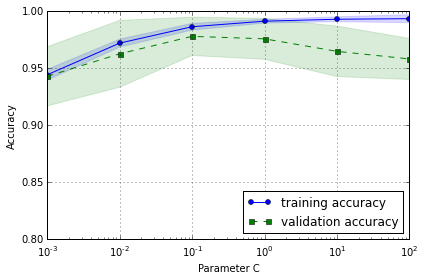

# What is overfitting?

Let’s assume we have a hypothesis or model m that we fit on our training data. In machine learning, the training performance — for example, accuracy — is what we measure and optimize during training time. Let’s call this training accuracy ACCtrain(*m*).

Now, what we really care about in machine learning is to build a model that generalizes well to unseen data, that is, we want to build a model that has a high accuracy on the whole distribution of data; let’s call this ACCpopulation(*m*). (Typically, we use cross-validation techniques and a separate, independent test set to estimate the  generalization performance.)

Now, overfitting occurs if there’s an alternative model *m'*  from the algorithm's hypothesis space where the training accuracy is better and the generalization performance is worse compared to model *m* -- we say that m overfits the training data.

### Learning Curves

As a rule of thumb, a model is more likely to overfit if it is too complex given a fixed number of training samples. The figure below shows the training and validation accuracies of a SVM model on a certain dataset. Here, I plotted the accuracy as a function of the inverse regularization parameter C -- the larger the value of C the larger the penalty term against complexity.

We observe a larger difference between training and test accuracy for increasing values of C (more complex models). Based on the plot, we can say that the model at < 10^-1 underfit the training data whereas the models > 10^-1 overfit the training data.

### Remedies

Remedies against overfitting include

1. Choose a simpler model by adding bias and/or reducing the number of parameters
	2. Adding regularization penalties
	3. Reducing the dimensionality of the feature space
2. Collecting more training data