i. Does mean centering or feature scaling affect a Principal Component Analysis?

Let us think about whether it matters or not if the variables are centered for applications such as Principal Component Analysis (PCA) if the PCA is calculated from the covariance matrix (i.e., the *k* principal components are the eigenvectors of the covariance matrix that correspond to the *k* largest eigenvalues).

###  1. Mean centering does not affect the covariance matrix
Here, the rational is: If the covariance is the same whether the variables are centered or not, the result of the PCA will be the same.

Let’s assume we have the 2 variables **x** and **y**. Then the covariance between the attributes is calculated as

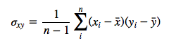

Let us write the centered variables as

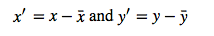

The centered covariance would then be calculated as follows:

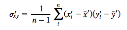

But since after centering, x&#772;'=0 and y&#772;'=0 we have

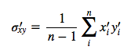

which is our original covariance matrix if we resubstitute back the terms

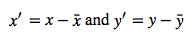

Even centering only one variable, e.g., **x** wouldn’t affect the covariance:

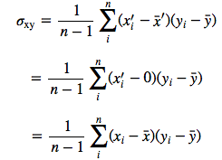

### 2. Scaling of variables does affect the covariance matrix

If one variable is scaled, e.g, from pounds into kilogram (1 pound = 0.453592 kg), it does affect the covariance and therefore influences the results of a PCA.

Let *c* be the scaling factor for *x*

Given that the “original” covariance is calculated as

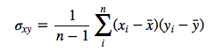

the covariance after scaling would be calculated as:

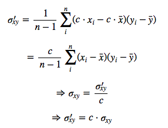

Therefore, the covariance after scaling one attribute by the constant *c*  will result in a rescaled covariance *c&sigma;xy*. So, if we’d scaled x from pounds to kilograms, the covariance between x and y will be 0.453592 times smaller.

### 3. Standardizing affects the covariance

Standardization of features will have an effect on the outcome of a PCA (assuming that the variables are originally not standardized). This is because we are scaling the covariance between every pair of variables by the product of the standard deviations of each pair of variables.

The equation for standardization of a variable is written as

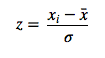

The “original” covariance matrix:

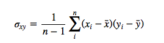

And after standardizing both variables:

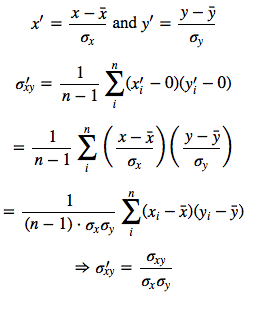
