# What is the difference between Pearson R and Simple Linear Regression?

In "simple linear regression" (ordinary least-squares regression with 1 variable), you fit a line    

y&#770; = a + b * x

in the attempt to predict the target variable  *y*  using the predictor *x*.

Let’s consider a simple example to illustrate how this is related to the linear correlation coefficient, a measure of how two variables are linearly related (or vary together).

x = [1.0, 1.8, 3.0, 3.7]  
y = [0.5, 2.0, 3.0, 3.9]

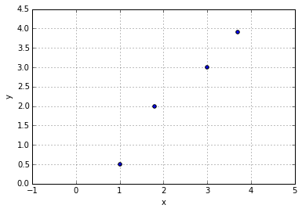

### Linear correlation between variables

The Pearson correlation coefficient is computed as:

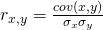

As we can see, the correlation coefficient is just the covariance (cov) between 2 features *x* and *y* “standardized” by their standard deviations (&sigma;), where

the standard deviation is computed as

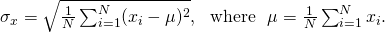

Similarly, the covariance is computed as

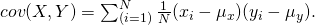

In our simple example above, we get

- cov(x, y) ≈  1.3012
- &sigma;_x ≈  1.0449
- &sigma;_y ≈  1.2620
- r = 0.9868

### Simple Linear Regression

Now, for simple linear regression, we compute the slope as follows:

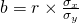

To show how the correlation coefficient r factors in, let's rewrite it as

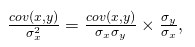

where the first term is equal to r, which we defined earlier; we can now see that we could use the “linear correlation coefficient” to compute the slope of the line as

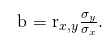

Continuing with the example from above, we get b ≈ 0.8171.

**So, essentially, the linear correlation coefficient (Pearson’s r) is just the standardized slope of a simple linear regression line (fit).**    
To continue with the example, we can now compute the y-axis intercept as

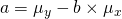

a ≈ 0.4298

Now, our linear regression fit would be

y&#770;  = 0.4298 + 0.8171 * x

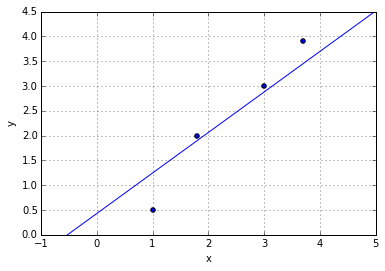

### Standardizing Variables

In practice, we often standardize our input variables:

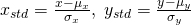

After standardization, our variables have the properties of a standard normal distribution with mean=0, and
standard deviation 1.

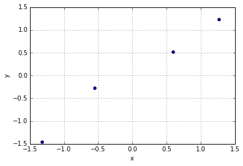

Or in other words, we center our variables at 0 so that we don’t need to compute the y-axis intercept.

y&#770; = a * x = r * x

This is also useful if we use optimization algorithms for multiple linear regression, such as gradient descent, instead of the closed-form solution (handy for working with large datasets). Here, we want to standardize the variables so that the gradient descent learning algorithms learns the model coefficients “equally” in multiple linear regression.
Another advantage of this approach is that the slope is then exactly the same as the correlation coefficient, which saves another computational step.

y&#770; = a * x = r * x = a * 0.9868

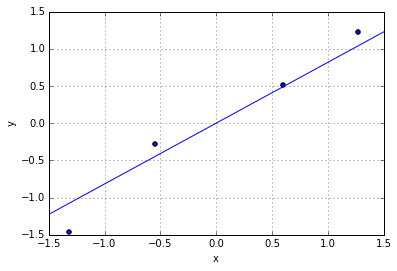
