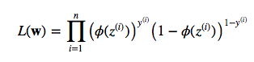
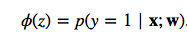
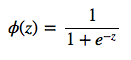
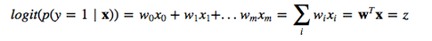
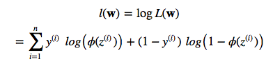
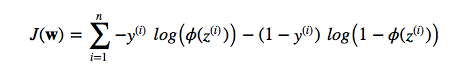
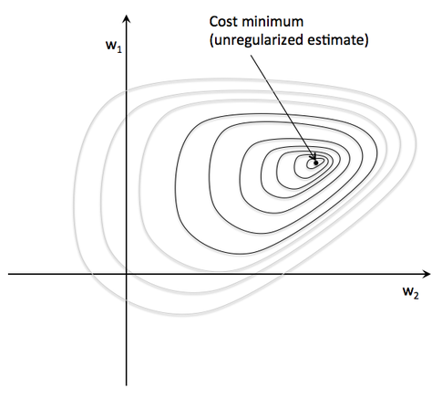
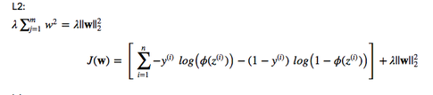
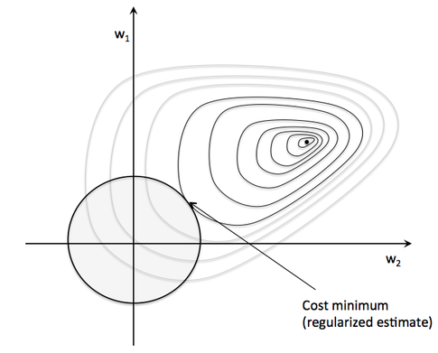

# What is the probabilistic interpretation of regularized logistic regression?

Let's start directly with the maximum likelihood function:

where phi is your conditional probability, i.e., sigmoid (logistic) function:

and z is simply the *net input* (a scalar):

So, by maximizing the likelihood we maximize the probability. Since we are talking about "cost", lets reverse the likelihood function so that we can minimize a cost function J. First, let's take the log so that we arrive at the equation that most people are familiar with (it's particularly handy to use the "addition trick" in the partial derivative e.g,. if you are using gradient or stochastic gradient descent):

Now, imagine we plot the cost as follows, as a function of the 2 weights in a 2D dataset. For the unregularized cost, we would find the global cost minimum (the dot at the center) for a particular w1 and w2 combination. The key idea is that we increase the weights as much as necessary to reach the global cost minimum.

Now, let's add a regularization term, e.g., L2

This basically means that we will increase the cost by the squared Euclidean norm of your weight vector. Or in other words, we are constraint now, and we can't reach the global minimum anymore due to this increasingly large penalty. Basically, we have to find the sweet spot now: the point that minimizes the cost under the constraint that ywer can't go to far on the w1 and w2 axes, respectively. (In the image below, the size of the sphere depends on an additional hyperparameter, lambda.)

It is as if we would add a prior to the weights. Instead of maximizing the likelihood (minimizing the cost function) given the training data, we maximize the likelihood given the additional information bias.
