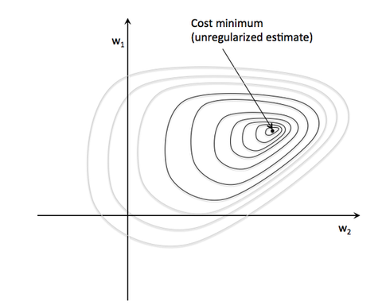
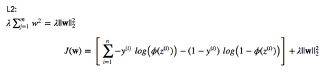
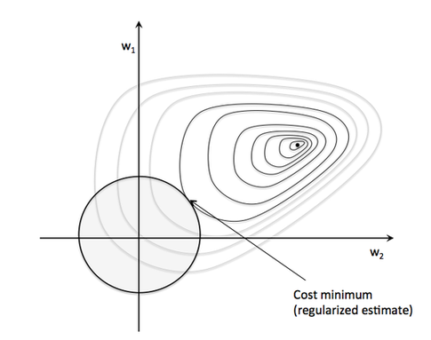

# Does regularization in logistic regression always results in better fit and better generalization?

Regularization does NOT improve the performance on the data set that the algorithm used to learn the model parameters (feature weights). However, it **can improve the generalization performance**, i.e., the performance on new, unseen data, which is exactly what we want.

In intuitive terms, we can think of regularization as a penalty against complexity. Increasing the regularization strength penalizes "large" weight coefficients -- our goal is to prevent that our model picks up "peculiarities," "noise," or "imagines a pattern where there is none."

**Again, we don't want the model to memorize the training dataset, we want a model that generalizes well to new, unseen data.**

In more specific terms, we can think of regularization as adding (or increasing the) bias if our model suffers from (high) variance (i.e., it overfits the training data). On the other hand, too much bias will result in underfitting (a characteristic indicator of high bias is that the model shows a "bad" performance for both the training and test dataset).
We know that our goal in an unregularized model is to minimize the cost function, i.e., we want to find the feature weights that correspond to the global cost minimum (remember that the logistic cost function is convex).

Now, if we regularize the cost function (e.g., via L2 regularization), we add an additional term to our cost function (J) that increases as the value of your parameter weights (w) increase; keep in mind that the regularization we add a new hyperparameter, lambda, to control the regularization strength.

Therefore, our new problem is to minimize the cost function given this added constraint.

Intuitively, we can think of the "sphere" at the coordinate center in the figure above as our "budget." Now, our objective is still the same: we want to minimize the cost function. However, we are now constrained by the regularization term; we want to get as close as possible to the global minimum while staying within our "budget" (i.e., the sphere).
