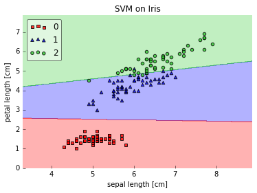
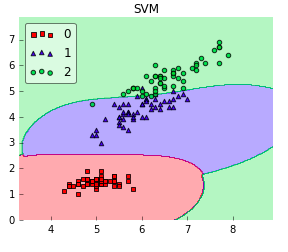
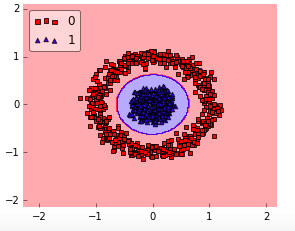
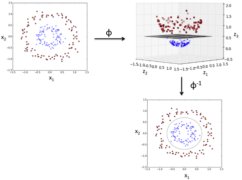

# How do I select SVM kernels?

Given an arbitrary dataset, you typically don't know which kernel may work best. I recommend starting with the simplest hypothesis space first -- given that you don't know much about your data -- and work your way up towards the more complex hypothesis spaces.
So, the linear kernel works fine if your dataset if linearly separable; however, if your dataset isn't linearly separable, a linear kernel isn't going to cut it (almost in a literal sense ;)).  
For simplicity (and visualization purposes), let's assume our dataset consists of 2 dimensions only. Below, I plotted the decision regions of a linear SVM on 2 features of the iris dataset:

This works perfectly fine. And here comes the RBF kernel SVM:

Now, it looks like both linear and RBF kernel SVM would work equally well on this dataset. So, why prefer the simpler, linear hypothesis? Think of Occam's Razor in this particular case. Linear SVM is a parametric model, an RBF kernel SVM isn't, and the complexity of the latter grows with the size of the training set. Not only is it more expensive to train an RBF kernel SVM, but you also have to keep the kernel matrix around, and the projection into this "infinite" higher dimensional space where the data becomes linearly separable is more expensive as well during prediction. Furthermore, you have more hyperparameters to tune, so model selection is more expensive as well! And finally, it's much easier to overfit a complex model!  
Okay, what I've said above sounds all very negative regarding kernel methods, but it really depends on the dataset. E.g., if your data is not linearly separable, it doesn't make sense to use a linear classifier:

In this case, a RBF kernel would make so much more sense:

In any case, I wouldn't bother too much about the polynomial kernel. In practice, it is less useful for efficiency (computational as well as predictive) performance reasons. So, the rule of thumb is: use linear SVMs (or logistic regression) for linear problems, and nonlinear kernels such as the Radial Basis Function kernel for non-linear problems.

The RBF kernel SVM decision region is actually also a linear decision region. What RBF kernel SVM actually does is to create non-linear combinations of your features to uplift your samples onto a higher-dimensional feature space where you can use a linear decision boundary to separate your classes:

Okay, above, I walked you through an intuitive example where we can visualize our data in 2 dimensions ... but what do we do in a real-world problem, i.e., a dataset with more than 2 dimensions? Here, we want to keep an eye on our objective function: minimizing the hinge-loss. We would setup a hyperparameter search (grid search, for example) and compare different kernels to each other. Based on the loss function (or a performance metric such as accuracy, F1, MCC, ROC auc, etc.) we could determine which kernel is "appropriate" for the given task.
