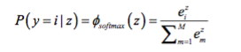
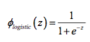
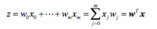

# What exactly is the "softmax and the multinomial logistic loss" in the context of machine learning?

The softmax function is simply a generalization of the logistic function that allows us to compute meaningful class-probabilities in multi-class settings (multinomial logistic regression). In softmax, we compute the probability that a particular sample (with net input z) belongs to the *i*th class using a normalization term in the denominator that is the sum of all *M* linear functions:

In contrast, the logistic function:

And for completeness, we define the net input as
 

where the weight coefficients of your model are stored as vector "w" and "x" is the feature vector of  your sample.  
