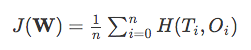

# What is Softmax regression and how is it related to Logistic regression?

Softmax Regression (synonyms: Multinomial Logistic, Maximum Entropy Classifier, or just Multi-class Logistic Regression) is a generalization of logistic regression that we can use for multi-class classification (under the assumption that the classes are mutually exclusive). In contrast, we use the (standard) Logistic Regression model in binary classification tasks.

Now, let me briefly explain how that works and how softmax regression differs from logistic regression. I have a more detailed explanation on logistic regression here: [LogisticRegression - mlxtend](http://rasbt.github.io/mlxtend/user_guide/classifier/LogisticRegression/) , but let me re-use one of the figures to make things more clear:

As the name suggests, in softmax regression (SMR), we replace the sigmoid logistic function by the so-called *softmax function* &phi;:

where we define the net input z as

(*w* is the weight vector, *x* is the feature vector of 1 training sample, and *w0* is the bias unit.)  
Now, this softmax function computes the probability that this training sample x(i) belongs to class *j* given the weight and net input z(i). So, we compute the probability *p(y = j | x(i); wj)* for each class label in  *j = 1, ..., k*. Note the normalization term in the denominator which causes these class probabilities to sum up to one.

To illustrate the concept of softmax, let us walk through a concrete example. Let's assume we have a training set consisting of 4 samples from 3 different classes (0, 1, and 2).

First, we want to encode the class labels into a format that we can more easily work with; we apply one-hot encoding:

A sample that belongs to class 0 (the first row) has a 1 in the first cell, a sample that belongs to class 2 has a 1 in the second cell of its row, and so forth.
Next, let us define the feature matrix of our 4 training samples. Here, we assume that our dataset consists of 2 features; thus, we create a 4&times;(2+1) dimensional matrix (+1 one for the bias term).

Similarly, we created a (2+1)&times;3 dimensional weight matrix (one row per feature and one column for each class).

To compute the net input, we multiply the 4&times;(2+1) feature matrix **X** with the (2+1)&times;3 (n_features &times; n_classes) weight matrix **W**.  

**Z = WX**

which yields a 4&times;3 output matrix (n_samples &times; n_classes).

Now, it's time to compute the softmax activation that we discussed earlier:

As we can see, the values for each sample (row) nicely sum up to 1 now. E.g., we can say that the first sample   
`[ 0.29450637  0.34216758  0.36332605]` has a 29.45% probability to belong to class 0.
Now, in order to turn these probabilities back into class labels, we could simply take the argmax-index position of each row:

As we can see, our predictions are terribly wrong, since the correct class labels are `[0, 1, 2, 2]`. Now, in order to train our logistic model (e.g., via an optimization algorithm such as gradient descent), we need to define a cost function *J* that we want to minimize:

which is the average of all cross-entropies over our n training samples. The cross-entropy  function is defined as

Here the T stands for "target" (the true class labels) and the O stands for output (the computed probability via softmax; ***not*** the predicted class label).

In order to learn our softmax model via gradient descent, we need to compute the derivative

which we then use to update the weights in opposite direction of the gradient:

 for each class j.

(Note that w_j is the weight vector for the class *y=j*.)
I don't want to walk through more tedious details here, but this cost derivative turns out to be simply:

Using this cost gradient, we iteratively update the weight matrix until we reach a specified number of epochs (passes over the training set) or reach the desired cost threshold.
