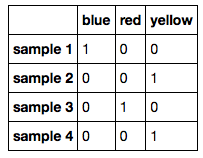

# How can I apply an SVM to categorical data?

I assume you are asking about categorical features, not the target variable, which is already assumed to be categorical (binary) in SVM classifiers.

First, there are two sub-types of categorical features: Ordinal and nominal features.

Ordinal means that an "order" is implied. For example, a customer satisfaction metric {'satisfied', 'neutral', 'dissatisfied'} is a ordinal variable since we can order it: 'satisfied' > 'neutral' > 'dissatisfied'. Here, we can simply map the 'string' notation into an integer notation, for example 'satisfied'=1, 'neutral' =0, and 'dissatisfied'= -1.

If our variable is *nominal*, an 'order' does not make sense. For example, think of 'color'; there are some cases in image processing where ordering color values makes sense, but for simplicity, we can't say 'red > blue > yellow' or so. To deal with such variables in SVM classification, we typically do a "one-hot" encoding. Here, we create so-called dummy variables that can binary values — we create one dummy variable for each possible value of that nominal feature variable. Say that our color variable can have one of the three values: 'red,' 'blue,' 'yellow.' And Let's say we have the following dataset consisting of 4 training samples:

- sample 1: 'blue'
- sample 2: 'yellow'
- sample 3: 'red'
- sample 4: 'yellow'

Then our one-hot encoding would look like this:

Note that there's only one "true" value (the integer 1) in each row, which denotes the column for that sample in the training set. Sample 1 is blue; sample 2 is yellow, and so forth.
