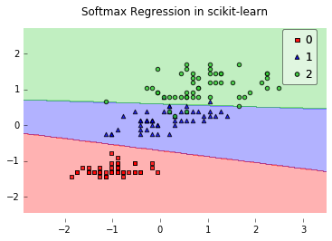
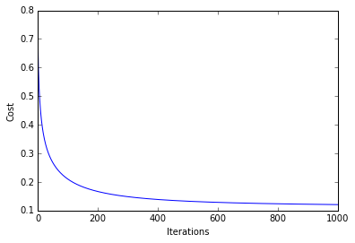
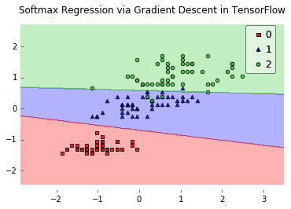

# What is the main difference between TensorFlow and scikit-learn?

TensorFlow is more of a low-level library; basically, we can think of TensorFlow as the Lego bricks (similar to NumPy and SciPy) that we can use to implement machine learning algorithms whereas scikit-learn comes with off-the-shelf algorithms, e.g., algorithms for classification such as SVMs, Random Forests, Logistic Regression, and many, many more. TensorFlow really shines if we want to implement deep learning algorithms, since it allows us to take advantage of GPUs for more efficient training.
To get a better idea of how these two libraries differ, let's fit a softmax regression model on the Iris dataset via scikit-learn:

```python
from sklearn.datasets import load_iris
from sklearn.linear_model import LogisticRegression
import matplotlib.pyplot as plt

# Loading Data
iris = load_iris()
X = iris.data[:, [0, 3]] # sepal length and petal width
y = iris.target

# standardize
X[:,0] = (X[:,0] - X[:,0].mean()) / X[:,0].std()
X[:,1] = (X[:,1] - X[:,1].mean()) / X[:,1].std()

lr = LogisticRegression(penalty='l2',
                        dual=False,
                        tol=0.000001,
                        C=10.0,
                        fit_intercept=True,
                        intercept_scaling=1,
                        class_weight=None,
                        random_state=1,
                        solver='newton-cg',
                        max_iter=100,
                        multi_class='multinomial',
                        verbose=0,
                        warm_start=False,
                        n_jobs=1)
lr.fit(X, y)
```

In addition, I have a little helper function to plot the 2D decision surface:

```python
from mlxtend.plotting import plot_decision_regions

plot_decision_regions(X, y, clf=lr)
plt.title('Softmax Regression in scikit-learn')
plt.show()
```



That was easy, right? :). Now, if we want to fit a Softmax regression model via TensorFlow, however, we have to "build" the algorithm first. But it really sounds more complicated than it really is.
TensorFlow comes with many "convenience" functions and utilities, for example, if we want to use a gradient descent optimization approach, the core or our implementation could look like this:

```python
# Construct the Graph
  g = tf.Graph()
  with g.as_default():

      if init_weights:
          self._n_classes = np.max(y) + 1
          self._n_features = X.shape[1]
          tf_weights_, tf_biases_ = self._initialize_weights(
              n_features=self._n_features,
              n_classes=self._n_classes)
          self.cost_ = []
      else:
          tf_weights_ = tf.Variable(self.weights_)
          tf_biases_ = tf.Variable(self.biases_)

      # Prepare the training data
      y_enc = self._one_hot(y, self._n_classes)
      n_idx = list(range(y.shape[0]))
      tf_X = tf.convert_to_tensor(value=X, dtype=self.dtype)
      tf_y = tf.convert_to_tensor(value=y_enc, dtype=self.dtype)
      tf_idx = tf.placeholder(tf.int32,
                              shape=[int(y.shape[0] / n_batches)])
      X_batch = tf.gather(params=tf_X, indices=tf_idx)
      y_batch = tf.gather(params=tf_y, indices=tf_idx)

      # Setup the graph for minimizing cross entropy cost
      logits = tf.matmul(X_batch, tf_weights_) + tf_biases_
      cross_entropy = tf.nn.softmax_cross_entropy_with_logits(logits,
                                                              y_batch)
      cost = tf.reduce_mean(cross_entropy)
      optimizer = tf.train.GradientDescentOptimizer(
          learning_rate=self.eta)
      train = optimizer.minimize(cost)

      # Initializing the variables
      init = tf.initialize_all_variables()
```

And we can execute the training as follows:

```python
# Launch the graph
with tf.Session(graph=g) as sess:
    sess.run(init)
    self.init_time_ = time()
    for epoch in range(self.epochs):
        if self.minibatches > 1:
            n_idx = np.random.permutation(n_idx)
        minis = np.array_split(n_idx, self.minibatches)
        costs = []
        for idx in minis:
            _, c = sess.run([train, cost], feed_dict={tf_idx: idx})
            costs.append(c)
```

```python
For demonstration purposes, I have implemented Softmax regression via TensorFlow in an object oriented style that is somewhat similar to scikit-learn's implementation. The complete code example can be found here if you are interested: [mlxtend/tf_classifier/TfSoftmax](https://github.com/rasbt/mlxtend/blob/master/mlxtend/tf_classifier/tf_softmax.py).
```

```python
from mlxtend.tf_classifier import TfSoftmaxRegression

lr = TfSoftmaxRegression(eta=0.75,
                         epochs=1000,
                         print_progress=True,
                         minibatches=1,
                         random_seed=1)

lr.fit(X, y)
Epoch: 1000/1000 | Cost 0.12

plt.plot(range(len(lr.cost_)), lr.cost_)
plt.xlabel('Iterations')
plt.ylabel('Cost')
plt.show()
```




```python
from mlxtend.plotting import plot_decision_regions

plot_decision_regions(X, y, clf=lr)
plt.title('Softmax Regression via Gradient Descent in TensorFlow')
plt.show()
```



**Note**

I've removed the TensorFlow code from mlxtend because it became pretty inconvenient to maintain. The original code should still be available through GitHub. E.g., if you install mlxtend 0.5.1, (`pip install mlxtend=0.5.1`) or browse through the files here: https://github.com/rasbt/mlxtend/tree/86e40d5af5222d78acf219cc8188cfd28a972d9e/mlxtend/tf_classifier
