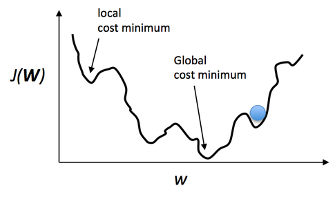
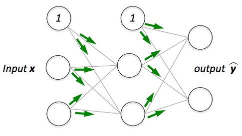
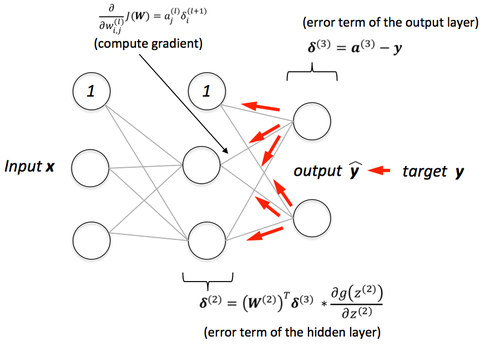
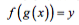
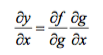

# Can you give a visual explanation for the back propagation algorithm for neural networks?

Let's assume we are really into mountain climbing, and to add a little extra challenge, we cover eyes this time so that we can't see where we are and when we accomplished our "objective," that is, reaching the top of the mountain.

Since we can't see the path upfront, we let our intuition guide us: assuming that the mountain top is the "highest" point of the mountain, we think that the steepest path leads us to the top most efficiently.   
We approach this challenge by iteratively "feeling" around you and taking a step into the direction of the steepest ascent -- let's call it "gradient ascent." But what do we do if we reach a point where we can't ascent any further? I.e., each direction leads downwards? At this point, we may have already reached the mountain's top, but we could just have reached a smaller plateau ... we don't know.
Essentially, this is just an analogy of gradient ascent optimization (basically the counterpart of minimizing a cost function via gradient descent). However, this is not specific to backpropagation but just one way to minimize a convex cost function (if there is only a global minima) or non-convex cost function (which has local minima like the "plateaus" that let us think we reached the mountain's top). Using a little visual aid, we could picture a non-convex cost function with only one parameter (where the blue ball is our current location) as follows:  

 

Now, backpropagation is just back-propagating the cost over multiple "levels" (or layers). E.g., if we have a multi-layer perceptron, we can picture forward propagation (passing the input signal through a network while multiplying it by the respective weights to compute an output) as follows:

And in backpropagation, we "simply" backpropagate the error (the "cost" that we compute by comparing the calculated output and the known, correct target output, which we then use to update the model parameters):

It may be some time ago since pre-calc, but it's essentially all based on the simple chain-rule that we use for nested functions

Instead of doing this "manually" we can use computational tools (called "automatic differentiation"), and backpropagation is basically the "reverse" mode of this auto-differentiation. Why reverse and not forward? Because it is computationally cheaper! If we'd do it forward-wise, we'd successively multiply large matrices for each layer until we multiply a large matrix by a vector in the output layer. However, if we start backwards, that is, we start by multiplying a matrix by a vector, we get another vector, and so forth. So, I'd say the beauty in backpropagation is that we are doing more efficient matrix-vector multiplications instead of matrix-matrix multiplications.
