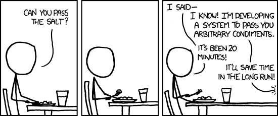
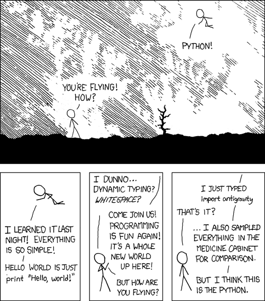

# Why did you choose Python for Machine Learning?

(Edit: This article is now also available in visually more appealing version [here](http://sebastianraschka.com/blog/2015/why-python.html).)

Oh god, another one of those subjective, pointedly opinionated click-bait headlines? Yes! Why did I bother writing this? Well, here is one of the most trivial yet life-changing insights and worldly wisdoms from my former professor that has become my mantra ever since: "If you have to do this task more than 3 times just write a script and automate it."  

By now, you may have already started wondering about this blog. I haven't written anything for more than half a year! Okay, [musings on social network platforms](https://twitter.com/rasbt) aside, that's not true: I have written [something](https://github.com/rasbt/python-machine-learning-book) -- about 400 pages to be precise. This has really been quite a journey for me lately. And regarding the frequently asked question "Why did you choose Python for Machine Learning?" I guess it is about time to write  *my script*.

 In the following paragraphs, I really don't mean to tell you why *you* or anyone else should use Python. To be honest, I really hate those types of questions: "Which * is the best?" (* insert "programming language, text editor, IDE, operating system, computer manufacturer" here). This is really a nonsense question and discussion. Sometimes it can be fun and entertaining though, but I recommend saving this question for our occasional after-work beer or coffee with friends and colleagues.

#### Table of Contents

- [The short answer to a complex question](#the-short-answer-to-a-complex-question)
- [What are my favorite Python tools?](#what-are-my-favorite-python-tools)
- [What do I think about MATLAB?](#what-do-i-think-about-matlab)
- [Julia is awesome ... on paper!](#julia-is-awesome-on-paper)
- [There is really nothing wrong with R](#there-is-really-nothing-wrong-with-r)
- [What happened to Perl?](#what-happened-to-perl)
- [Other options](#other-options)
- [Is Python a dying language?](#is-python-a-dying-language)
- [Conclusion](#conclusion)
- [Feedback-and-opinions](#Feedback-and-opinions)

## The short answer to a complex question
[[back to top](#table-of-contents)]

Maybe I should start with the short answer. You are welcome to stop reading this article below this paragraph because it really nails it. I am a scientist, I like to get my stuff done. I like to have an environment where I can quickly prototype and jot down my models and ideas. I need to solve very particular problems. I analyze given datasets to draw my conclusions. This is what matters most to me: How can I get the job done most productively? What do I mean by "productively"? Well, I typically run an analysis only once (the testing of different ideas and debugging aside); I don't need to repeatedly run a particular piece of code 24/7, I am not developing software applications or web apps for end users. When I *quantify* "productivity," I literally estimate the sum of (1) the time that it takes to get the idea written down in code, (2) debug it, and (3) execute it. To me, "most productively" means "how long does it take to get the results?" Now, over the years, I figured that Python is for me. Not always, but very often. Like everything else in life, Python is not a "silver bullet," it's not the "best" solution to every problem. However, it comes pretty close if you compare programming languages across the spectrum of common and not-so common problem tasks; Python is probably the most versatile and capable all-rounder.

(Source: [https://xkcd.com/974/](https://xkcd.com/974/))

Remember: "Premature optimization is the root of all evil" (Donald Knuth). If you are part of the software engineering team that wants to optimize the next game-changing high-frequency trading model from your machine learning and data science division, Python is probably not for you (but maybe it was the language of choice by the data science team, so it may still be useful to learn how to read it). So, my little piece of advice is to evaluate your daily problem tasks and needs when you choose a language. "If all that you have is a hammer, everything starts to look like a nail" -- you are too smart to fall for this trap! However, keep in mind that there is a balance. There are occasions where the hammer may be the best choice even if a screwdriver would probably be the "nicer" solution. Again, it comes down to productivity.

**Let me give you an example from personal experience.**
I needed to develop a bunch of novel algorithms to "screen" 15 million small, chemical compounds with regard to a very problem specific hypothesis. I am an entirely computational person, but I am collaborating with biologists who do non-computational experiments (we call them "wet lab" experiments). The goal was to narrow it down to a list of 100 potential compounds that they could test in their lab. The caveat was that they needed the results quickly, because they only had limited time to conduct the experiments.

> You’re bound to be unhappy if you optimize everything.         — Donald Knuth

Trust me, time was really "limited:" We just got our grant application accepted and research funded a few weeks before the results had to be collected (our collaborators were doing experiments on larvae of a certain fish species that only spawns in Spring). Therefore, I started thinking "How could I get those results to them as quickly as possible?" Well, I know C++ and FORTRAN, and if I implement those algorithms in the respective languages executing the "screening" run may be faster compared to a Python implementation. This was more of an educated guess, I don't really know if it would have been substantially faster. But there was one thing I knew for sure: If I started developing the code in Python, I could be able to get it to run in a few days -- maybe it would take a week to get the respective C++ versions coded up. I would worry about a more efficient implementation later. At that moment, it was just important to get those results to my collaborators -- "Premature optimization is the root of all evil." On a side node: The same train of thought applies to data storage solutions. Here, I just went with SQLite. CSV didn't make quite sense since I had to annotate and retrieve certain molecules repeatedly. I surely didn't want to scan or rewrite a CSV from start to end every time I wanted to look up a molecule or manipulate its entry -- issues in dealing with memory capacities aside. Maybe MySQL would have been even better but for the reasons mentioned above, I wanted to get the job done quickly, and setting up an additional SQL server ... there was no time for that, SQLite was just fine to get the job done.

(Source: [https://xkcd.com/1319/](https://xkcd.com/1319/))

The verdict: **Choose the language that satisfies *your* needs!**
However, there is once little caveat here! How can a beginning programmer possibly know about the advantages and disadvantages of a language before learning it, and how should the programmer know if this language will be useful to her at all? This is what I would do: Just search for particular applications and solutions related to your most common problem tasks on Google and [GitHub](https://github.com). You don't need to read and understand the code. Just look at the end product.

> In the one and only true way. The object-oriented version of 'Spaghetti code' is, of course, 'Lasagna code'. (Too many layers). — Roberto Waltman.

Also, don't hesitate to ask people. Don't just ask about the "best" programming language in general but be specific, describe your goals and why you want to learn how to program. If you want to develop applications for MacOS X you will probably want to check out Objective C and Swift, if you want to develop on Android, you are probably more interested in learning Java and so on.

## What are my favorite Python tools?
[[back to top](#table-of-contents)]

If you are interested, those are my favorite and most frequently used Python "tools," I use most of them on a daily basis.

- [NumPy](http://www.numpy.org): My favorite library for working with array structures and vectorizing equations using linear algebra; augmented by [SciPy](http://scipy2015.scipy.org/ehome/index.php?eventid=115969&).
- [Theano](https://theano.readthedocs.org/en/latest/): Implementing machine learning algorithms for the heavy-lifting and distributing computations across cores in my GPU(s).
- [scikit-learn](http://scikit-learn.org/stable/): The most convenient API for the daily, more basic machine learning tasks.
- [matplotlib](http://matplotlib.org): My library of choice when it comes to plotting. Sometimes I also use [seaborn](http://stanford.edu/~mwaskom/software/seaborn/index.html) for particular plots, for example, the heat maps are particularly great!

(Source: [http://stanford.edu/~mwaskom/software/seaborn/examples/structured_heatmap.html](http://stanford.edu/~mwaskom/software/seaborn/examples/structured_heatmap.html))

- [Flask (Django)](http://flask.pocoo.org): Rarely, I want to turn an idea into a web application. Here, Flask comes in very handy!
- [SymPy](http://www.sympy.org/en/index.html): For symbolic math, it replaced WolframAlpha for me.
- [pandas](http://pandas.pydata.org): Working with relatively small datasets, mostly from CSV files.
- [sqlite3](https://docs.python.org/2/library/sqlite3.html): Annotating and querying "medium-sized" datasets.
- [IPython notebooks](http://ipython.org): What can I say, 90% of my research takes place in IPython notebooks. It's just a great environment to have everything in one place: Ideas, code, comments, LaTeX equations, illustrations, plots, outputs, ...  

Note that the IPython Project recently evolved into [Project Jupyter](https://jupyter.org). Now, you can use Jupyter notebook environment not only for Python but R, Julia, and many more.

## What do I think about MATLAB?
[[back to top](#table-of-contents)]

I used MATLAB (/Octave) quite extensively some years ago; most of the computer science-data science
classes were taught in MATLAB. I really think that it's not a bad environment for
prototyping after all! Since it was built with linear algebra in mind (MATLAB for MATrix LABoratory), MATLAB feels a tad more "natural" when it comes to implementing machine learning algorithms compared to Python/NumPy -- okay, to be fair, [1-indexed](https://www.cs.utexas.edu/users/EWD/transcriptions/EWD08xx/EWD831.html) programming languages may seem a little bit weird to us programmers.
However, keep in mind that MATLAB comes with a big
price tag, and I think it is slowly fading from academia as well as industry. Plus, I am a big fan open-source enthusiast after all ;). In addition, its performance is also not that compelling compared to other "productive" languages looking at the benchmarks below:

(Benchmark times relative to C -- smaller is better, C performance = 1.0; Source: [http://julialang.org/benchmarks/](http://julialang.org/benchmarks/))

However, we should not forget that there is also this neat Theano library for Python. In 2010, the developers of Theano reported an 1.8x faster performance than NumPy when the code was run on the CPU, and if Theano targeted the GPU, it was even 11x faster than NumPy (J. Bergstra, O. Breuleux, F. Bastien, P. Lamblin, R. Pascanu, G. Desjardins, J. Turian, D. Warde-Farley, and Y. Bengio. Theano: A CPU and GPU math compiler in Python. In Proc. 9th Python in Science Conf, pages 1–7, 2010.). Now, keep in mind that this Theano benchmark is from 2010, and Theano has improved significantly over the years and so did the capabilities of modern graphics cards.

> I have learned that many of the Greeks believe Pythagoras said all things are generated from number. The very assertion poses a difficulty: How can things which do not exist even be conceived to generate? - Theano of Croton (Philosopher, 6th-century BC)

PS: If you don't like NumPy's `dot` method, stay tuned for the upcoming [Python 3.5](https://docs.python.org/3.6/whatsnew/3.5.html) -- we will get an infix [operator](http://legacy.python.org/dev/peps/pep-0465/) for matrix multiplication, yay!

Matrix-matrix multiplication "by hand" (I mean without the help of NumPy and BLAS or LAPACK looks tedious and pretty inefficient).

    [[1, 2],     [[5, 6],     [[1 * 5 + 2 * 7, 1 * 6 + 2 * 8],
    [3, 4]]  x   [7, 8]]  =   [3 * 5 + 4 * 7, 3 * 6 + 4 * 8]]

Who wants to implement this expression using nested for-loops if we have linear algebra and libraries that are optimized to take care of it!?

<pre><code>    &gt;&gt;&gt; X = numpy.array()
    &gt;&gt;&gt; W = numpy.array()
</code></pre>

<pre><code>    &gt;&gt;&gt; X.dot(W)
    [[19, 22],
    [43, 50]]
</code></pre>

Now, if this <code>dot</code> product does not appeal to you, this is how it will look like in Python 3.5: 

<pre><code>    &gt;&gt;&gt; X @ W
    [[19, 22],
    [43, 50]]
</code></pre>
To be honest, I have to admit that I am not necessarily a big fan of the "@" symbol as matrix operator. However, I really thought long and hard about this and couldn't find any better "unused" symbol for this purpose. If you have a better idea, please let me know, I am really curious!

## Julia is awesome ... on paper!
[[back to top](#table-of-contents)]

I think Julia is a great language, and I would like to recommend it to someone who's getting started with programming and machine learning. I am not sure if I really should though. Why? There is this sad, somewhat paradoxical thing about committing to programming languages. With Julia, we cannot tell if it will become "popular" enough in the next few years.

> There are only two kinds of languages: the ones people complain about and the ones nobody uses — Bjarne Stroustrup

Wait, what does "popularity" have to do with how good and useful a programming language is? Let me tell you. The dilemma is that the most useful languages are not necessarily the ones that are well designed but the ones that are popular. Why?

1. There are a lot of (mostly free) libraries out there already so that you can make best use of your time and don't have to reinvent the wheel.
2. It is much easier to find help, tutorials, and examples online.
3. The language improves, gets updated, and patches are applied more frequently to make it "even better."
4. It is better for collaboration and easier to work in teams.
5. More people will benefit from your code (for example, if you decide to share it on GitHub).

Personally, I love Julia for what it is. It perfectly fits my niche of interest. I use Python though; mainly because there is so much great stuff out there that makes it especially handy. The Python community is just great, and I believe that it will be around and thriving in the (at least) next 5 to 10 upcoming years. With Julia, I am not so sure. I love the design, I think it's great. Nevertheless, if it is not popular, I can't tell if it is "future-proof." What if the development stops in a couple of years? I would have invested in something that will be "dead" at that point. However, if everyone would think like this, no new language would ever stand a chance.

## There is really nothing wrong with R
[[back to top](#table-of-contents)]

Well, I guess it's no big secret that I was an R person once. I even wrote a book about it (okay, it was actually about [Heat maps in R](http://www.amazon.com/Instant-Heat-Maps-R-How-/dp/1782165649/ref=sr_1_1?ie=UTF8&qid=1372160113&sr=8-1&keywords=instant+heat+maps+in+r+how-to) to be precise. Note that this was years ago, before `ggplot2` was a thing. There's no real compelling reason to check it out -- I mean the book. However, if you can't resist, here's is the free, 5-minute-read [short version](http://sebastianraschka.com/Articles/heatmaps_in_r.html)).
I agree, this is a bit of a digression. So, back to the discussion: What's wrong with R? I think there is nothing wrong with it at all. I mean, it's pretty powerful and a capable and "popular" language for "data science" after all! Not too long ago even Microsoft became really, really interested: [Microsoft acquires Revolution Analytics, a commercial provider of services for the open source R programming language for statistical computing and predictive analytics](http://www.cio.com/article/2906456/data-analytics/microsoft-closes-acquisition-of-r-software-and-services-provider.html).

So, how can I summarize my feelings about R? I am not exactly sure where this quote is comes from -- I picked it up from someone somewhere some time ago -- but it is great for explaining the difference between R and Python: "R is a programming language developed by statisticians for statisticians; Python was developed by a computer scientist, and it can be used by programmers to apply statistical techniques." Part of the message is that both R and Python are similarly capable for "data science" tasks, however, the Python syntax simply feels more natural to me -- it's a personal taste.

I just wanted to bring up Theano and computing on GPUs as a big plus for Python, but I saw that R is also pretty capable: [Parallel Programming with GPUs and R](http://blog.revolutionanalytics.com/2015/01/parallel-programming-with-gpus-and-r.html). I know what you want to ask next: "Okay, what about turning my model into a nice and *shiny* web application? I bet this is something that you can't do in R!" Sorry, but you lose this bet; have a look at [Shiny by RStudio A web application framework for R](http://www.rstudio.com/shiny/). You see what I am getting at? There is no winner here. There will probably never be.

> When someone says: 'I want a programming language in which I need only say what I wish done', give him a lollipop. — Alan J. Perlis

To take one of my favorite Python quotes out of its original context: "We are all adults here" -- let's not waste our time with language wars. Choose the tool that "clicks" for you. When it comes to perspectives on the job market: There is no right or wrong here either. I don't think a company that wants to hire you as a "data scientist" really bothers about your favorite toolbox -- programming languages are just "tools" after all. The most important skill is to think like a "data scientist," to ask the right questions, to solve a problems. The hard part is the math and machine learning theory, a new programming language can easily be learned. Just think about, you learned how to swing a hammer to drive the nail in, how hard can it possibly be to pick up a hammer from a different manufacturer?
 But if you are still interested, look at the Tiobe Index for example, *one* measure of popularity of programming languages:

(Source: [http://www.tiobe.com/index.php/content/paperinfo/tpci/index.html](http://www.tiobe.com/index.php/content/paperinfo/tpci/index.html))

However, if we look at the [The 2015 Top Ten Programming Languages](http://spectrum.ieee.org/computing/software/the-2015-top-ten-programming-languages) by Spectrum IEEE, the R language is climbing fast (left column: 2015, right column: 2014).

(Source: [http://spectrum.ieee.org/computing/software/the-2015-top-ten-programming-languages](http://spectrum.ieee.org/computing/software/the–2015-top-ten-programming-languages))

I think you get the idea. Python and R, there's really no big difference anymore. Moreover, you shouldn't worry about job opportunities when you are choosing one language over the other.

## What happened to Perl?
[[back to top](#table-of-contents)]

Perl was the first language I picked up in my early career
(aside from Basic, Pascal, and Delphi in High School of course). I took a Perl programming class when I was still an undergrad in Germany. At that time I really liked it, but hey, I really didn't have anything to compare it to at this point either. Personally, I only know a handful of people who are actively using Perl for scripting on a day-to-day basis. I think it is still quite common in the bioinformatics field though!? Anyways, let's keep this part short so that it can rest in peace: "["Perl is Dead. Long live Perl."](http://archive.oreilly.com/pub/post/perl_is_dead_long_live_perl.html)

## Other options
[[back to top](#table-of-contents)]

There are many other languages that can are used for Machine Learning, for example, [Ruby](https://www.ruby-lang.org) ([Thoughtful Machine Learning: A Test-Driven Approach](http://www.amazon.com/Thoughtful-Machine-Learning-Test-Driven-Approach/dp/1449374069/ref=sr_1_1?ie=UTF8&qid=1440407371&sr=8-1&keywords=machine+learning+ruby)), [Java](https://www.java.com/en/) ([Java-ML](http://java-ml.sourceforge.net)), [Scala](http://www.scala-lang.org) ([Breeze](https://github.com/scalanlp/breeze)), [Lua](http://www.lua.org) ([Torch](http://torch.ch)), and so on. However, except for a Java class I attended years ago, or [PySpark](https://spark.apache.org/docs/0.9.0/python-programming-guide.html), a Python API for Spark, which is written in Scala, I really don't have much experience with those languages and wouldn't know what to say.

## Is Python a dying language? ##
[[back to top](#table-of-contents)]

This is a legit question, it came up on Quora recently, and if you want to hear many other great opinions on this, check out the [question thread](http://www.quora.com/Is-it-true-that-Python-is-a-dying-language). However, if you want to hear my opinion, I would say No, it is not. Why? Okay, Python is "relatively" old language - the first release was sometime in the early 90s (we can start counting at 1991), and like with every programming language, certain choices and compromises had to be made. Every programming language has its quirks, and the more modern languages tend to learn from the mistakes of the past, which is a good thing (R was released not long after Python by the way: 1995).
Python is far from being "perfect," and like every other language, it has its warts. As a core Python user, I have to say that the GIL (Global Interpreter Lock) is what annoys me most -- but note that there a multiprocessing and multithreading modules, and it's not really a limitation but more of a little "inconvenience" in certain contexts.

There is no metric that can quantify "how good" a programming language is, and it really depends on what you are looking for. The question you'd want to ask is: "What do I want to achieve, and which is the best tool to accomplish that" -- "if all you have is a hammer, everything looks like a nail."
Speaking of hammers and nails again, Python is extremely versatile, the largest chunk of my day-to-day research happens via Python using the great scikit-learn machine learning library, pandas for data munging, matplotlib/seaborn for visualization, and IPython notebooks to keep track of all those things.

## Conclusion
[[back to top](#table-of-contents)]

Well, this is a pretty long answer to a seemingly very simple question. Trust me, I can go on for hours and days. But why complicate things? Let's bring the talks to a conclusion:

(Source: [https://xkcd.com/353/](https://xkcd.com/353/))
